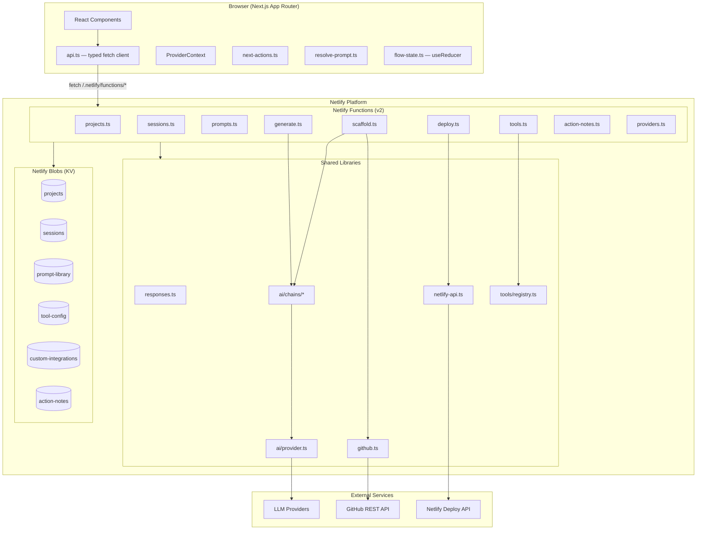
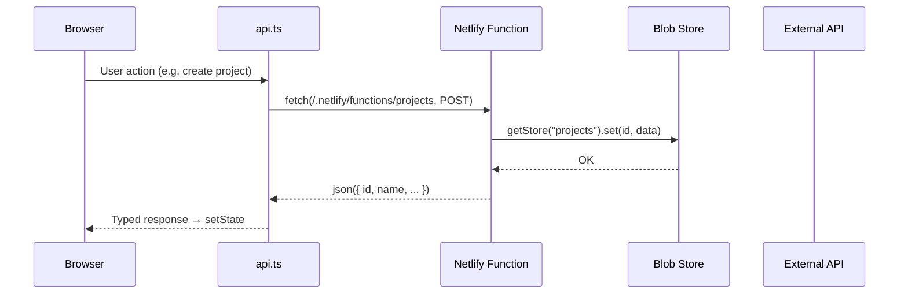
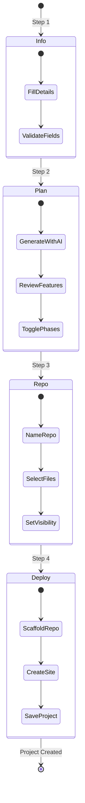

# Architecture

> Developer continuity tool that tracks project momentum, automates scaffolding, and keeps you in flow between sessions.

## 1. High-Level Overview

buffr is a full-stack web application that helps solo developers and small teams maintain momentum across coding sessions. It provides:

- **Project dashboard** — track projects through lifecycle phases (idea → mvp → polish → deploy)
- **Session logging** — record what changed, what's next, and any blockers
- **AI-powered scaffolding** — generate project plans and scaffold repos with LLM assistance
- **Next actions engine** — automatically suggest what to work on based on session history, activity gaps, and GitHub issues
- **Prompt library** — reusable prompt templates with project-context variable resolution
- **Tool integrations** — MCP-compatible registry for GitHub, Notion, and custom integrations

The app follows a client-server split: a Next.js frontend communicates with Netlify Functions that handle AI generation, GitHub operations, and persistent storage via Netlify Blobs.

## 2. Tech Stack

| Layer | Technology | Version |
|-------|-----------|---------|
| Framework | Next.js (App Router) | 16.x |
| UI | React | 19.x |
| Styling | Tailwind CSS (v4 via `@tailwindcss/postcss`) | 4.x |
| Language | TypeScript | 5.x |
| Backend | Netlify Functions v2 | 5.x |
| Storage | Netlify Blobs (KV) | 10.x |
| AI | LangChain.js (multi-provider) | — |
| AI Providers | Anthropic, OpenAI, Google Gemini, Ollama | — |
| Hosting | Netlify | — |
| Bundler | esbuild (functions) | — |

## 3. Directory Structure

```
buffr/
├── src/
│   ├── app/                    # Next.js App Router pages
│   │   ├── layout.tsx          # Root layout with Nav + ProviderContext
│   │   ├── page.tsx            # Dashboard (project list)
│   │   ├── new/page.tsx        # New project flow (4-step wizard)
│   │   ├── load/page.tsx       # Import existing GitHub repo
│   │   ├── project/[id]/       # Project detail & session management
│   │   ├── prompts/page.tsx    # Prompt library CRUD
│   │   ├── tools/page.tsx      # Tools & integrations management
│   │   └── globals.css         # Tailwind v4 theme + custom properties
│   ├── components/
│   │   ├── ui/                 # Primitive UI components
│   │   │   ├── badge.tsx       # Status badges with variants
│   │   │   ├── button.tsx      # Button with variant/size props
│   │   │   ├── card.tsx        # Card container
│   │   │   ├── checkbox.tsx    # Checkbox input
│   │   │   ├── input.tsx       # Text input
│   │   │   ├── modal.tsx       # Dialog overlay
│   │   │   ├── notification.tsx # Toast notifications
│   │   │   ├── progress-step.tsx # Step indicator dots
│   │   │   ├── textarea.tsx    # Multiline input
│   │   │   └── toggle.tsx      # Toggle switch
│   │   ├── dashboard/
│   │   │   └── project-card.tsx # Project card on dashboard
│   │   ├── flow/               # New-project wizard steps
│   │   │   ├── step-info.tsx   # Step 1: project details
│   │   │   ├── step-plan.tsx   # Step 2: AI plan generation
│   │   │   ├── step-repo.tsx   # Step 3: repo + file selection
│   │   │   ├── step-deploy.tsx # Step 4: scaffold + deploy
│   │   │   ├── step-indicator.tsx
│   │   │   └── load-existing.tsx # Import existing repo form
│   │   ├── session/            # Project detail tab panels
│   │   │   ├── resume-card.tsx # Main session view with tabs
│   │   │   ├── session-tab.tsx # Last session info
│   │   │   ├── issues-tab.tsx  # GitHub issues list
│   │   │   ├── actions-tab.tsx # Next actions with notes
│   │   │   ├── prompts-tab.tsx # Resolved prompts for project
│   │   │   └── end-session-modal.tsx
│   │   ├── tools/              # Tools page modals
│   │   │   ├── add-integration-modal.tsx
│   │   │   ├── config-modal.tsx
│   │   │   └── test-tool-modal.tsx
│   │   ├── nav.tsx             # Top navigation bar
│   │   ├── command-palette.tsx # Cmd+K command palette
│   │   └── provider-switcher.tsx # LLM provider dropdown
│   ├── context/
│   │   └── provider-context.tsx # React context for LLM provider selection
│   ├── hooks/                  # Custom React hooks (reserved)
│   └── lib/
│       ├── types.ts            # All shared TypeScript interfaces
│       ├── api.ts              # Typed fetch wrapper for all API calls
│       ├── constants.ts        # Shared constants (PHASE_BADGE_VARIANTS)
│       ├── next-actions.ts     # Next-actions generation engine
│       ├── flow-state.ts       # useReducer state for project wizard
│       └── resolve-prompt.ts   # Template variable resolution
├── netlify/
│   └── functions/
│       ├── projects.ts         # CRUD for projects
│       ├── sessions.ts         # CRUD for sessions
│       ├── prompts.ts          # CRUD for prompt library
│       ├── generate.ts         # AI plan generation endpoint
│       ├── scaffold.ts         # GitHub repo/issues/analysis/scaffold
│       ├── deploy.ts           # Netlify site creation + deploy
│       ├── tools.ts            # Tool integrations CRUD + execution
│       ├── action-notes.ts     # Per-action notes persistence
│       ├── providers.ts        # Available LLM providers list
│       └── lib/
│           ├── responses.ts    # Shared json(), errorResponse(), classifyError()
│           ├── github.ts       # GitHub REST API wrapper
│           ├── netlify-api.ts  # Netlify Deploy API wrapper
│           ├── ai/
│           │   ├── provider.ts # Multi-provider LLM factory
│           │   ├── chains/
│           │   │   ├── plan-generator.ts  # LangChain plan generation chain
│           │   │   └── file-generator.ts  # LangChain file content chain
│           │   └── prompts/
│           │       ├── plan-prompt.ts     # Plan generation prompt template
│           │       └── file-prompts.ts    # File generation prompt template
│           ├── storage/        # Netlify Blobs store accessors
│           │   ├── projects.ts
│           │   ├── sessions.ts
│           │   ├── prompts.ts
│           │   ├── action-notes.ts
│           │   ├── tool-config.ts
│           │   └── custom-integrations.ts
│           └── tools/          # MCP-compatible tool system
│               ├── registry.ts # registerTool / executeTool / listTools
│               ├── github.ts   # GitHub tool definitions
│               └── notion.ts   # Notion tool definitions (stub)
├── netlify.toml                # Build config + function settings
├── package.json
├── tsconfig.json
└── .env.example                # Environment variable template
```

## 4. System Architecture



### Request Flow



### New Project Flow



## 5. Key Modules & Components

### Frontend

| Module | Purpose |
|--------|---------|
| `api.ts` | Typed fetch wrapper — every backend call goes through `request<T>()`, which handles JSON parsing, error extraction, and Content-Type headers |
| `flow-state.ts` | `useReducer`-based state machine for the 4-step project creation wizard. Defines `FlowState`, `FlowAction` union type, and `flowReducer` |
| `next-actions.ts` | Priority-ordered action generator. Sources: (1) session nextStep, (2) activity gaps >7 days, (3) top 3 GitHub issues. Capped at 3 actions |
| `resolve-prompt.ts` | Template engine replacing `{{project.name}}`, `{{project.description}}`, etc. with actual project values |
| `provider-context.tsx` | React context providing `{provider, setProvider}` across the app, persisted to `localStorage` |
| `resume-card.tsx` | Tabbed project view (Session / Issues / Actions / Prompts) — the core "resume your work" experience |
| `command-palette.tsx` | Cmd+K palette for quick navigation between projects and pages |

### Backend

| Module | Purpose |
|--------|---------|
| `responses.ts` | Shared utilities: `json()` for JSON responses, `errorResponse()` for error responses, `classifyError()` to map error messages to HTTP status codes (402/401/429/422/400/500) |
| `ai/provider.ts` | Factory function `getLLM(provider)` returning a LangChain `BaseChatModel`. Supports Anthropic, OpenAI, Google, Ollama. `getAvailableProviders()` checks which API keys are configured |
| `ai/chains/plan-generator.ts` | LangChain `RunnableSequence` that generates a `ProjectPlan` from description + constraints + goals. Includes `parsePlanOutput()` with JSON validation |
| `ai/chains/file-generator.ts` | LangChain chain for generating individual file contents (README, ARCHITECTURE.md, etc.) during scaffolding |
| `github.ts` | GitHub REST API wrapper: `getUserRepos()`, `createRepo()`, `commitFiles()` (via Git Data API for multi-file commits), `getIssues()`, `analyzeRepo()` (detects stack, phase, CI, tests) |
| `netlify-api.ts` | `createSite()` with UUID-suffixed names, `deployPlaceholder()` that pushes a dark-themed "coming soon" HTML page |
| `tools/registry.ts` | MCP-compatible tool registry: `registerTool()`, `executeTool()`, `listToolsByIntegration()`. Tools are stored in an in-memory `Map<string, Tool>` |

### Storage Layer

All persistence uses Netlify Blobs — a KV store scoped per deploy. Six named stores:

| Store | Key Pattern | Value |
|-------|------------|-------|
| `projects` | `{projectId}` | `Project` object |
| `sessions` | `{projectId}:{sessionId}` | `Session` object |
| `prompt-library` | `{promptId}` | `Prompt` object |
| `tool-config` | `{integrationId}` | `ToolConfig` (encrypted values) |
| `custom-integrations` | `{integrationId}` | `CustomIntegration` definition |
| `action-notes` | `{projectId}` | `Record<actionId, note>` |

Each storage module exports typed CRUD functions (e.g. `getProject()`, `setProject()`, `listProjects()`, `deleteProject()`).

## 6. Data Models

```typescript
// Core domain entities

interface Project {
  id: string;
  name: string;
  description: string;
  constraints: string;
  goals: string;
  stack: string;
  phase: "idea" | "mvp" | "polish" | "deploy";
  lastSessionId: string | null;
  githubRepo: string | null;        // "owner/repo"
  repoVisibility: "public" | "private";
  netlifySiteId: string | null;
  netlifySiteUrl: string | null;
  plan: ProjectPlan | null;
  selectedFeatures: string[] | null;
  selectedFiles: string[] | null;
  issueCount?: number;
  updatedAt: string;
}

interface Session {
  id: string;
  projectId: string;
  goal: string;
  whatChanged: string[];
  nextStep: string;
  blockers: string | null;
  createdAt: string;
}

interface Prompt {
  id: string;
  title: string;
  body: string;                      // Supports {{project.*}} templates
  tags: string[];
  scope: "global" | string;          // "global" or projectId
  createdAt: string;
  updatedAt: string;
}

interface ProjectPlan {
  projectName: string;
  description: string;
  recommendedStack: string;
  features: PlanFeature[];
  deployChecklist: string[];
}

interface PlanFeature {
  name: string;
  description: string;
  complexity: "simple" | "medium" | "complex";
  phase: 1 | 2;
  checked: boolean;
}

interface NextAction {
  id: string;
  text: string;
  done: boolean;
  skipped: boolean;
  source?: "session" | "activity" | "issue";
}

interface ToolIntegration {
  id: string;
  name: string;
  description: string;
  status: "connected" | "error" | "not_configured";
  tools: ToolDefinition[];
  configFields: { key: string; label: string; secret: boolean }[];
}
```

## 7. API Surface

All endpoints are Netlify Functions v2 mounted at `/.netlify/functions/{name}`. Routing within a function uses HTTP method + query parameters.

### Projects (`/projects`)

| Method | Query | Description |
|--------|-------|-------------|
| GET | — | List all projects |
| GET | `?id={id}` | Get single project |
| POST | — | Create project |
| PUT | `?id={id}` | Update project |
| DELETE | `?id={id}` | Delete project + sessions |

### Sessions (`/sessions`)

| Method | Query | Description |
|--------|-------|-------------|
| GET | `?projectId={id}` | List sessions for project |
| POST | — | Create session (updates project.lastSessionId) |

### Prompts (`/prompts`)

| Method | Query | Description |
|--------|-------|-------------|
| GET | `?scope={scope}` | List prompts (optional scope filter) |
| POST | — | Create prompt |
| PUT | `?id={id}` | Update prompt |
| DELETE | `?id={id}` | Delete prompt |

### Generate (`/generate`)

| Method | Body | Description |
|--------|------|-------------|
| POST | `GeneratePlanRequest` | Generate AI project plan |

### Scaffold (`/scaffold`)

| Method | Query | Description |
|--------|-------|-------------|
| GET | `?repos` | List user's GitHub repos |
| GET | `?analyze={owner/repo}` | Analyze repo (stack, phase, issues) |
| GET | `?issues={owner/repo}` | Fetch repo issues |
| GET | `?validate={owner/repo}` | Validate repo exists, return metadata |
| POST | — | Scaffold repo (create repo, generate + commit files) |

### Deploy (`/deploy`)

| Method | Body | Description |
|--------|------|-------------|
| POST | `DeployRequest` | Create Netlify site + deploy placeholder |

### Tools (`/tools`)

| Method | Query | Description |
|--------|-------|-------------|
| GET | — | List all integrations with status |
| POST | `?create` | Create custom integration |
| POST | `?execute` | Execute a registered tool |
| PUT | `?integrationId={id}` | Save integration config |
| DELETE | `?integrationId={id}` | Remove custom integration |

### Action Notes (`/action-notes`)

| Method | Query | Description |
|--------|-------|-------------|
| GET | `?projectId={id}` | Get notes for project |
| PUT | `?projectId={id}` | Save note for an action |

### Providers (`/providers`)

| Method | Description |
|--------|-------------|
| GET | List configured LLM providers + default |

## 8. Configuration & Environment

### Required (at least one LLM provider)

| Variable | Purpose | Default |
|----------|---------|---------|
| `ANTHROPIC_API_KEY` | Claude API access | — |
| `OPENAI_API_KEY` | GPT API access | — |
| `GOOGLE_API_KEY` | Gemini API access | — |
| `OLLAMA_BASE_URL` | Local Ollama endpoint | — |

### Optional

| Variable | Purpose | Default |
|----------|---------|---------|
| `ANTHROPIC_MODEL` | Override Claude model | `claude-sonnet-4-20250514` |
| `OPENAI_MODEL` | Override GPT model | `gpt-4o` |
| `GOOGLE_MODEL` | Override Gemini model | `gemini-1.5-pro` |
| `OLLAMA_MODEL` | Override Ollama model | `llama3` |
| `DEFAULT_LLM_PROVIDER` | Default provider on load | `anthropic` |
| `GITHUB_TOKEN` | GitHub PAT (repo scope) | — |
| `NETLIFY_TOKEN` | Netlify PAT | — |

The frontend detects available providers via `GET /providers` and only shows those with configured keys. Provider selection persists to `localStorage`.

## 9. Build, Test & Deploy

### Development

```bash
cp .env.example .env   # Configure at least one LLM provider
npm install
npm run dev            # Next.js dev server + Netlify Functions
```

### Build

```bash
npm run build          # Next.js production build
```

### Deploy

Configured via `netlify.toml`:
- **Build command:** `npm run build`
- **Publish directory:** `.next`
- **Functions directory:** `netlify/functions`
- **Function bundler:** `esbuild`

Deployment is automatic on push to the connected branch via Netlify's CI/CD.

### Lint

```bash
npm run lint           # ESLint 9 with Next.js config
```

### Testing

No test framework is currently configured. See Known Limitations.

## 10. Design Decisions & Trade-offs

| Decision | Rationale |
|----------|-----------|
| **Netlify Blobs over a database** | Zero-config KV storage that works in both dev and production. No migrations, no connection pooling. Trade-off: no relational queries, no indexing beyond key prefix scans |
| **Multi-provider LLM via LangChain** | Avoids vendor lock-in. Users choose their preferred provider (or use local Ollama). LangChain provides a uniform `BaseChatModel` interface while each provider SDK handles auth and serialization |
| **Netlify Functions v2 (default export)** | Uses Web API `Request`/`Response` objects instead of the v1 callback pattern. Simpler, more portable. Routing within a function uses query params rather than separate function files for related endpoints |
| **Client-side next-actions engine** | `generateNextActions()` runs in the browser, keeping the backend stateless. Actions are computed from session + project data already fetched, avoiding an extra API call |
| **`useReducer` for project wizard** | The 4-step wizard has complex interdependent state (plan depends on info, repo depends on plan). A reducer centralizes transitions and makes the state machine explicit |
| **Template variables in prompts** | `{{project.name}}`, `{{project.description}}`, etc. are resolved client-side via `resolvePrompt()`. This keeps prompts reusable across projects without server involvement |
| **MCP-compatible tool registry** | Tools follow a `{ name, description, inputSchema, execute }` interface modeled after MCP. This makes future MCP server integration straightforward |
| **No auth layer** | buffr is designed as a personal/team tool deployed to a private Netlify site. Authentication is deferred in favor of simplicity. Access control relies on Netlify's deploy visibility settings |
| **GitHub Git Data API for commits** | Uses the low-level Git Data API (create blobs → create tree → create commit → update ref) instead of the Contents API. This enables atomic multi-file commits during scaffolding |
| **Dark theme by default** | CSS custom properties defined in `globals.css` with a dark color palette. All components reference semantic tokens (`--foreground`, `--background`, `--accent`, etc.) |

## 11. Known Limitations & TODOs

- **No test suite** — no unit or integration tests. Test framework not yet configured.
- **No authentication** — anyone with the URL can access all projects and data. Suitable only for personal or team-internal deployments.
- **Notion integration is stubbed** — `tools/notion.ts` exists but `registerNotionTools()` is commented out pending implementation.
- **No real-time updates** — data is fetched on page load. No WebSocket or polling for collaborative use.
- **Blob storage limitations** — no secondary indexes, no range queries. Listing sessions requires prefix scan. Performance may degrade with thousands of entries.
- **No offline support** — all operations require network access to Netlify Functions.
- **Single-user session model** — sessions don't track which user created them. Multi-user support would require auth + user association.
- **No prompt versioning** — prompt edits overwrite in place. No history or rollback.
- **LLM error handling is basic** — rate limits and credit exhaustion are classified but not retried automatically.
- **Scaffold is one-shot** — generated files are committed once. No incremental re-generation or diff-based updates.
