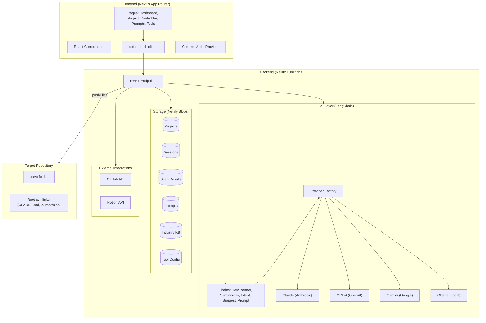
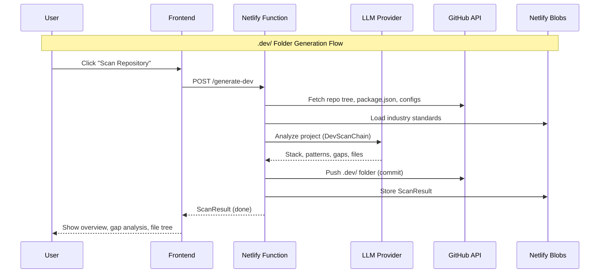

# Architecture

## High-Level Overview

Buffr is a developer productivity tool that generates project intelligence for AI coding assistants. It scans repositories, analyzes them against industry best practices, generates a `.dev/` folder with conventions, standards, gap analysis, and adapter configs, and pushes it to the repo. Any AI tool (Claude Code, Cursor, Copilot) that reads project files automatically picks up this context.

The secondary function is session tracking: developers record what they worked on, and the app uses LLMs to summarize sessions, detect intent, and suggest next steps.

**Core problem**: AI coding tools lack project-specific context. Buffr bridges this by generating structured intelligence that lives in the repo.

---

## Tech Stack

| Layer | Technology |
|-------|-----------|
| Frontend | Next.js 16 (App Router), React 19, TypeScript 5 |
| Styling | Tailwind CSS 4, BEM-named CSS modules with `@apply` |
| Backend | Netlify Functions (serverless Node.js) |
| Storage | Netlify Blobs (key-value store) |
| AI/LLM | LangChain.js (Anthropic, OpenAI, Google, Ollama) |
| Integrations | GitHub API, Notion API |
| Auth | JWT (jose), HTTP Basic login |
| Deployment | Netlify (CDN + Functions + Blobs) |

---

## Directory Structure

```
buffr/
├── src/
│   ├── app/                    # Next.js App Router pages
│   │   ├── page.tsx            # Dashboard (project listing)
│   │   ├── login/              # Auth page
│   │   ├── project/[id]/       # Project detail (resume card)
│   │   ├── dev-folder/[id]/    # .dev/ folder viewer & scanner
│   │   ├── prompts/            # Prompt library
│   │   └── tools/              # Integration configuration
│   ├── components/
│   │   ├── ui/                 # Reusable primitives (Button, Modal, Badge)
│   │   ├── dashboard/          # ProjectCard, ImportProjectModal
│   │   ├── session/            # ResumeCard, EndSessionModal, tabs
│   │   ├── dev-folder/         # OverviewTab, GapTab, FileTreeTab, AdaptersTab
│   │   └── tools/              # ToolCard, DataSourceCheckboxes
│   ├── context/                # React Context (auth, LLM provider)
│   ├── lib/                    # Shared utilities & types
│   │   ├── types.ts            # All TypeScript interfaces
│   │   ├── api.ts              # API client (all fetch calls)
│   │   ├── next-actions.ts     # Action generation logic
│   │   ├── suggestions.ts      # Project suggestion engine
│   │   └── resolve-prompt.ts   # Template variable resolution
│   └── middleware.ts           # JWT auth middleware
├── netlify/functions/          # Serverless API
│   ├── lib/
│   │   ├── ai/
│   │   │   ├── provider.ts     # LLM factory (Claude, GPT, Gemini, Ollama)
│   │   │   ├── chains/         # LangChain sequences
│   │   │   │   ├── dev-scanner.ts         # Repo analysis chain
│   │   │   │   ├── session-summarizer.ts  # Activity summarizer
│   │   │   │   ├── intent-detector.ts     # Work intent classifier
│   │   │   │   ├── next-step-suggester.ts # Next step generator
│   │   │   │   └── prompt-chain.ts        # Generic prompt execution
│   │   │   └── prompts/        # System prompt templates
│   │   ├── storage/            # Netlify Blobs persistence layer
│   │   ├── tools/              # Integration tool registry
│   │   ├── github.ts           # GitHub API client
│   │   └── notion.ts           # Notion API client
│   ├── generate-dev.ts         # .dev/ folder generation endpoint
│   ├── session-ai.ts           # Session AI (summarize, intent, suggest)
│   ├── run-prompt.ts           # Prompt execution with variable resolution
│   ├── projects.ts             # Project CRUD
│   ├── sessions.ts             # Session tracking
│   └── ...                     # Other endpoints
├── .dev/                       # Generated project intelligence (committed to repo)
└── netlify.toml                # Deployment config
```

---

## System Architecture


```mermaid
graph TB
    subgraph Frontend ["Frontend (Next.js App Router)"]
        Pages[Pages: Dashboard, Project, DevFolder, Prompts, Tools]
        Components[React Components]
        APIClient["api.ts (fetch client)"]
        Context["Context: Auth, Provider"]
    end

    subgraph Backend ["Backend (Netlify Functions)"]
        Endpoints["REST Endpoints"]

        subgraph AI ["AI Layer (LangChain)"]
            Provider["Provider Factory"]
            Chains["Chains: DevScanner, Summarizer, Intent, Suggest, Prompt"]
            Provider --> Claude["Claude (Anthropic)"]
            Provider --> GPT["GPT-4 (OpenAI)"]
            Provider --> Gemini["Gemini (Google)"]
            Provider --> Ollama["Ollama (Local)"]
        end

        subgraph Storage ["Storage (Netlify Blobs)"]
            Projects[(Projects)]
            Sessions[(Sessions)]
            ScanResults[(Scan Results)]
            Prompts[(Prompts)]
            IndustryKB[(Industry KB)]
            ToolConfig[(Tool Config)]
        end

        subgraph Integrations ["External Integrations"]
            GitHub["GitHub API"]
            Notion["Notion API"]
        end
    end

    subgraph Repo ["Target Repository"]
        DevFolder[".dev/ folder"]
        Adapters["Root symlinks (CLAUDE.md, .cursorrules)"]
    end

    Pages --> APIClient
    APIClient --> Endpoints
    Endpoints --> AI
    Endpoints --> Storage
    Endpoints --> Integrations
    AI --> Chains
    Chains --> Provider
    Endpoints -->|pushFiles| Repo
```

### Request Lifecycle


```mermaid
sequenceDiagram
    participant U as User
    participant FE as Frontend
    participant API as Netlify Function
    participant LLM as LLM Provider
    participant GH as GitHub API
    participant DB as Netlify Blobs

    Note over U,DB: .dev/ Folder Generation Flow
    U->>FE: Click "Scan Repository"
    FE->>API: POST /generate-dev
    API->>GH: Fetch repo tree, package.json, configs
    API->>DB: Load industry standards
    API->>LLM: Analyze project (DevScanChain)
    LLM-->>API: Stack, patterns, gaps, files
    API->>GH: Push .dev/ folder (commit)
    API->>DB: Store ScanResult
    API-->>FE: ScanResult (done)
    FE-->>U: Show overview, gap analysis, file tree
```

---

## Key Modules & Components

### AI Chain Architecture

Each chain follows the same pattern: **input schema → system prompt → LLM invocation → output parsing**.

| Chain | Input | Output | Purpose |
|-------|-------|--------|---------|
| `DevScanChain` | Project metadata, stack, industry standards | detectedStack, patterns, gapAnalysis, generatedFiles | Analyze repo and generate .dev/ folder |
| `SessionSummarizerChain` | Activity items (commits, issues) | goal, bullets | Summarize what happened in a session |
| `IntentDetectorChain` | goal, whatChanged, phase | intent (2-5 words) | Classify what the developer was doing |
| `NextStepSuggesterChain` | goal, changes, context, open items | suggestedNextStep | Recommend what to work on next |
| `PromptChain` | Resolved prompt, tool names | text, suggestedActions, artifact | Execute a prompt with tool awareness |

**Chain composition** uses LangChain's `RunnableSequence`:
```typescript
RunnableSequence.from([
  { input: (data) => formatPrompt(data) },
  llm,
  (response) => parseOutput(response),
])
```

### Provider Factory

`getLLM(provider: string)` returns a `BaseChatModel` configured from environment variables. Supports hot-switching between providers at runtime via the UI's provider selector.

### Tool Registry

Pluggable integration system using a registry pattern:
```typescript
registerTool({
  name: "github_list_issues",
  integrationId: "github",
  inputSchema: { ... },
  execute: async (input) => { ... }
});
```

Tools are discovered dynamically and can be invoked via `{{tool:github_list_issues}}` tokens in prompts.

---

## Data Models

### Project
```typescript
interface Project {
  id: string;
  name: string;
  description?: string;
  stack?: string;
  phase: "idea" | "mvp" | "polish" | "deploy";
  githubRepo?: string;           // "owner/repo"
  netlifySiteUrl?: string;
  dataSources?: string[];         // ["github", "notion"]
  devFolder?: {
    status: "generated";
    lastScan: string;
    scanResultId: string;
    gapScore: { aligned, partial, gap } | null;
    adapters: string[];
  };
  techDebt?: TechDebtScan;
  dismissedSuggestions?: string[];
}
```

### ScanResult
```typescript
interface ScanResult {
  id: string;
  projectId: string;
  repoFullName: string;
  status: "idle" | "scanning" | "analyzing" | "generating" | "done" | "failed";
  detectedStack: string[];
  fileTree: ScanResultFile[];
  detectedPatterns: DetectedPattern[];
  generatedFiles: { path: string; content: string; ownership: string }[];
  gapAnalysis: GapAnalysisEntry[];     // { practice, industry, project, status, category }
  detectedAdapters: string[];
  analysisSource?: "llm" | "rule-based" | "imported";
}
```

### File Ownership Model
| Level | Behavior |
|-------|----------|
| `system` | Regenerated on every re-scan |
| `reviewable` | Changes proposed as diff, user approves |
| `append-only` | Buffr adds entries, never edits/removes |
| `user` | Never overwritten by buffr |

### Session
```typescript
interface Session {
  id: string;
  projectId: string;
  goal?: string;
  whatChanged?: string[];
  nextStep?: string;
  blockers?: string;
  detectedIntent?: string;          // AI-generated
  suggestedNextStep?: string;       // AI-generated
  aiSummary?: { goal, bullets[] };  // AI-generated
}
```

---

## API Surface

### Projects
| Method | Endpoint | Description |
|--------|----------|-------------|
| GET | `/projects` | List all projects |
| GET | `/projects?id=xxx` | Get single project |
| POST | `/projects` | Create project |
| PUT | `/projects?id=xxx` | Update project |
| DELETE | `/projects?id=xxx` | Delete project |

### .dev/ Generation
| Method | Endpoint | Description |
|--------|----------|-------------|
| POST | `/generate-dev` | Scan repo & generate .dev/ folder |
| POST | `/generate-dev?push` | Push generated files to GitHub |
| POST | `/generate-dev?install-adapter` | Create root symlink for adapter |
| POST | `/detect-dev` | Check if repo has existing .dev/ |
| GET | `/scan-results?id=xxx` | Get scan result |
| PUT | `/scan-results?id=xxx` | Update generated files |

### Session AI
| Method | Endpoint | Description |
|--------|----------|-------------|
| POST | `/session-ai?summarize` | Summarize activity items |
| POST | `/session-ai?intent` | Detect work intent |
| POST | `/session-ai?suggest` | Suggest next step |

### Tools & Integrations
| Method | Endpoint | Description |
|--------|----------|-------------|
| GET | `/tools` | List integrations with status |
| PUT | `/tools?integrationId=xxx` | Save integration config |
| POST | `/tools?execute` | Execute a tool action |

### Industry KB
| Method | Endpoint | Description |
|--------|----------|-------------|
| GET | `/industry-kb?technology=xxx` | Get standard for technology |
| POST | `/industry-kb?seed` | Seed/refresh knowledge base |

---

## Configuration & Environment

```bash
# LLM Providers (configure at least one)
ANTHROPIC_API_KEY=sk-ant-...
ANTHROPIC_MODEL=claude-sonnet-4-20250514      # default
OPENAI_API_KEY=sk-...
OPENAI_MODEL=gpt-4o                           # default
GOOGLE_API_KEY=...
OLLAMA_BASE_URL=http://localhost:11434
DEFAULT_LLM_PROVIDER=anthropic

# Integrations
GITHUB_TOKEN=ghp_...
NOTION_TOKEN=ntn_...

# Auth
AUTH_USERNAME=...
AUTH_PASSWORD=...
AUTH_SECRET=random-secret-for-jwt
```

`netlify.toml` configures build, functions directory, and local dev timeout (120s for LLM calls).

---

## Build, Test & Deploy

```bash
# Install
npm install

# Local development (frontend + backend)
netlify dev --timeout 120

# Build
npm run build

# Test
npm test                 # Vitest

# Deploy
netlify deploy --prod    # or git push (auto-deploy)
```

---

## Design Decisions & Trade-offs

| Decision | Rationale |
|----------|-----------|
| **Netlify Blobs over a database** | Zero-config, no external DB dependency. Trade-off: no indexing, in-memory filtering. Sufficient for single-user/small-team use. |
| **LangChain over raw API calls** | Chain composition, provider abstraction, structured output parsing. Trade-off: heavier dependency, abstraction overhead. |
| **Multi-provider LLM support** | Users can switch between Claude, GPT, Gemini, Ollama. Flexibility for cost/quality trade-offs. |
| **File ownership model** | Prevents buffr from overwriting user edits. Critical for trust — users must feel safe editing generated files. |
| **Symlinks for adapters** | AI tools expect config at repo root (CLAUDE.md, .cursorrules). Symlinks avoid duplication while keeping source of truth in .dev/adapters/. |
| **Two-stage prompt resolution** | Sync variable replacement + async tool execution. Allows prompts to reference live data (GitHub issues) without exposing API keys to the client. |
| **BEM CSS with Tailwind @apply** | Component-scoped styles with consistent naming. Avoids className collision in large component tree. |
| **Serverless functions over a server** | Scales to zero, no infra management, matches Netlify deployment model. Trade-off: cold starts, 30s default timeout (extended to 120s). |

---

## Known Limitations & TODOs

- **No auth on session-ai endpoint** — publicly accessible LLM calls
- **No rate limiting** on LLM endpoints
- **In-memory filtering** for sessions/scan results (no DB indexing)
- **No streaming** for LLM responses (chains return full response)
- **No input truncation** — large repos could exceed LLM context window
- **Single-user auth** — no multi-user support, no teams
- **Cold starts** on Netlify Functions affect LLM call latency
- **Industry KB is static seed data** — not automatically updated
