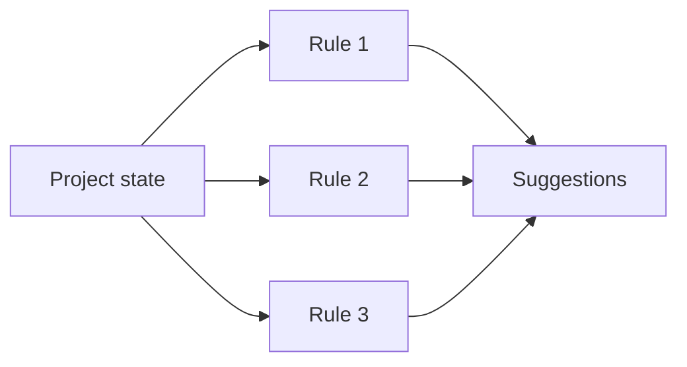
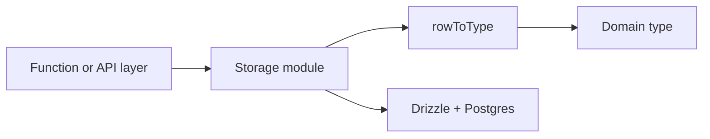
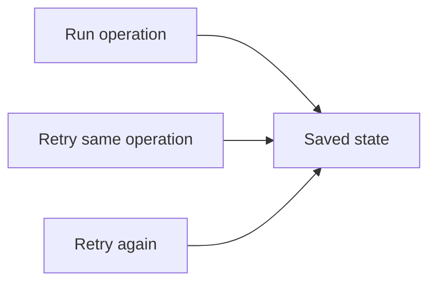
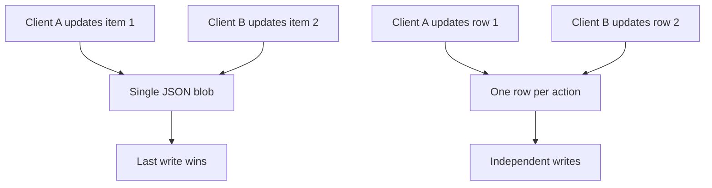
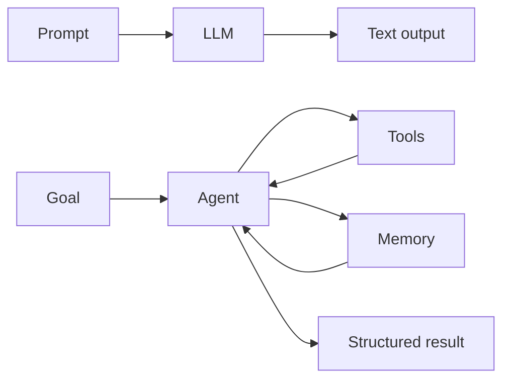
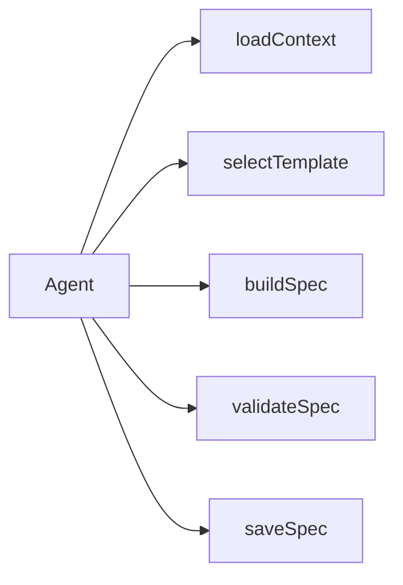
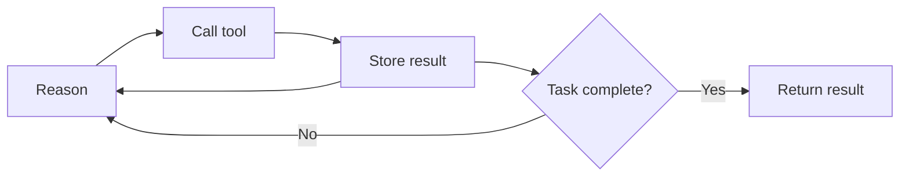
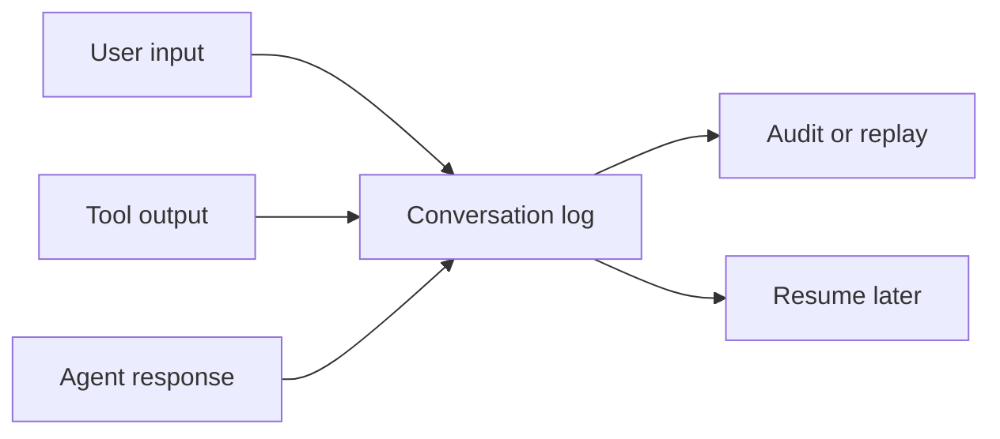

# buffr — Learning Through Your Own Code

> Every concept below is grounded in a specific file, function, or pattern in this codebase. No generic definitions — only what you actually built.

---

## Concept Index

| # | Concept | Category | Difficulty |
|---|---------|----------|------------|
| 1 | [Schema-First Development](#1-schema-first-development) | Thinking in Code | Foundational |
| 2 | [Type-Driven Design](#2-type-driven-design) | Thinking in Code | Foundational |
| 3 | [Separation of Concerns](#3-separation-of-concerns) | Systems Thinking | Foundational |
| 4 | [Provider Abstraction](#4-provider-abstraction) | Thinking in Code | Foundational |
| 5 | [Capability Mapping](#5-capability-mapping) | Systems Thinking | Foundational |
| 6 | [Rule-Based Engines](#6-rule-based-engines) | Systems Thinking | Foundational |
| 7 | [Optimistic UI](#7-optimistic-ui) | Thinking in Code | Intermediate |
| 8 | [Rollback Patterns](#8-rollback-patterns) | Thinking in Code | Intermediate |
| 9 | [Error Classification](#9-error-classification) | Thinking in Code | Intermediate |
| 10 | [Prompt Engineering](#10-prompt-engineering) | AI Product Engineering | Intermediate |
| 11 | [Prompt Chaining](#11-prompt-chaining) | Agentic AI | Intermediate |
| 12 | [Structured Output Parsing](#12-structured-output-parsing) | AI Product Engineering | Intermediate |
| 13 | [Storage Abstraction](#13-storage-abstraction) | Systems Thinking | Intermediate |
| 14 | [Migration Strategy (Strangler Fig)](#14-migration-strategy-strangler-fig) | Systems Thinking | Intermediate |
| 15 | [Idempotency](#15-idempotency) | Systems Thinking | Intermediate |
| 16 | [Race Conditions & Structural Fixes](#16-race-conditions--structural-fixes) | Systems Thinking | Intermediate |
| 17 | [Context Window Management](#17-context-window-management) | AI Product Engineering | Intermediate |
| 18 | [Persona-Based Prompting](#18-persona-based-prompting) | AI Product Engineering | Intermediate |
| 19 | [LLM vs Agent](#19-llm-vs-agent) | Agentic AI | Advanced |
| 20 | [Tool Calling](#20-tool-calling) | Agentic AI | Advanced |
| 21 | [ReAct Loop](#21-react-loop) | Agentic AI | Advanced |
| 22 | [Conversation Memory](#22-conversation-memory) | Agentic AI | Advanced |
| 23 | [Spec-Driven Development](#23-spec-driven-development) | AI Product Engineering | Advanced |
| 24 | [Adapter Pattern](#24-adapter-pattern) | Language-Agnostic | Intermediate |
| 25 | [Upsert Pattern](#25-upsert-pattern) | Language-Agnostic | Foundational |
| 26 | [Indirection via Lookup Tables](#26-indirection-via-lookup-tables) | Language-Agnostic | Foundational |

---

## 1. Schema-First Development

**Category:** Thinking in Code | **Difficulty:** Foundational

**What it is:** Define your data structures before writing any application logic. The schema becomes the contract that all layers — storage, API, and UI — agree on. Changes propagate from schema outward.

**Where it lives:** `netlify/functions/lib/db/schema.ts` defines 10 tables using Drizzle ORM. Every table definition (columns, types, indexes, foreign keys) is the single source of truth. `drizzle.config.ts` points at this file, and `drizzle-kit generate` produces migration SQL from it.

**Why it exists:** buffr migrated from Netlify Blobs (schemaless key-value) to Postgres. Without a schema-first approach, the migration would have required re-discovering data shapes from scattered code. The schema file made the migration mechanical: define tables, generate SQL, backfill data.

**General rule:** Start every feature by defining the data shape. If you can't describe the schema, you don't understand the feature yet. This applies whether you're using SQL, NoSQL, or even flat files — the schema is the thinking, not the database.

**Go deeper:** Read the Drizzle ORM docs on schema declaration. Compare with Prisma's schema-first approach. Notice how buffr's schema uses `text` for enum-like fields (phase, category, status) instead of Postgres enums — this is a portability choice documented in the plan's "portability rules."

---

## 2. Type-Driven Design

**Category:** Thinking in Code | **Difficulty:** Foundational

**What it is:** Use TypeScript's type system to make invalid states unrepresentable. Types act as documentation, guardrails, and refactoring tools simultaneously.

**Where it lives:** `src/lib/types.ts` exports every shared interface. Union types like `BuffrSpecCategory` (9 literal values) and `BuffrSpecStatus` (4 values) constrain what can flow through the system. The UI components in `buffr-specs-tab.tsx` map these same union values to colors, labels, and filter options — the type is the source of truth for the entire feature.

**Why it exists:** When categories were removed from `.dev` items early in the project, the TypeScript compiler found every reference that needed updating — across 8 files in one pass. Without types, those would have been runtime bugs discovered in production.

**General rule:** Every time you find yourself writing `string` for a field that has a known set of values, replace it with a union type. The compiler becomes your refactoring partner.

**Go deeper:** Notice that `ManualActionData` in `api.ts` and `ManualAction` in `storage/manual-actions.ts` are separate interfaces with slightly different fields (`createdAt` exists on the API side but not storage). This is intentional — the API type represents what the frontend needs, the storage type represents what the database stores. Bridging them is the storage module's job.

---

## 3. Separation of Concerns

**Category:** Systems Thinking | **Difficulty:** Foundational

**What it is:** Each module should have one reason to change. Organize code so that changing the database doesn't require changing the UI, and changing the AI provider doesn't require changing the storage layer.


**Where it lives:** buffr has four clean layers:
1. **Schema** (`lib/db/schema.ts`) — data shape
2. **Storage** (`lib/storage/*.ts`) — data access (Drizzle queries)
3. **Functions** (`netlify/functions/*.ts`) — HTTP handlers (parse request, call storage, return JSON)
4. **API client** (`src/lib/api.ts`) — fetch wrapper (the frontend's view of the backend)
5. **UI** (`src/components/session/*.tsx`) — React components

Each Netlify function imports from storage, never from the DB client directly. The UI imports from `api.ts`, never from storage.

**Why it exists:** During the Blob-to-Postgres migration (Phases 3-6), only the storage layer changed. The Netlify functions, API client, and UI components were untouched. This made a risky migration safe — each phase was independently deployable.

**General rule:** If changing one thing forces you to change something unrelated, you have a coupling problem. The fix is usually to add a layer of indirection (an interface, a wrapper function, or an adapter).

**Go deeper:** Compare `projects.ts` the Netlify function (HTTP concerns) with `storage/projects.ts` (data concerns). The function handles query params, error responses, and JSON serialization. The storage module handles Drizzle queries and row-to-type mapping. Neither knows about the other's concerns.

---

## 4. Provider Abstraction

**Category:** Thinking in Code | **Difficulty:** Foundational

**What it is:** Hide implementation differences behind a common interface so that swapping implementations doesn't require changing callers.

**Where it lives:** `netlify/functions/lib/ai/provider.ts` exports `getLLM(provider: string)` which returns a `BaseChatModel` — the LangChain base class that Anthropic, OpenAI, Google, and Ollama all implement. Every chain (`session-summarizer.ts`, `intent-detector.ts`, `paraphraser.ts`, `context-generator.ts`) accepts `BaseChatModel` as input, never a specific provider.

**Why it exists:** The user can switch providers via a dropdown in the nav. The same summarization chain works with Claude, GPT-4, Gemini, or a local Ollama model. Adding a new provider means adding one case to `getLLM()` — zero changes to chains or UI.

**General rule:** When you have multiple implementations of the same capability, define the interface first, then make each implementation conform. Callers depend on the interface, not the implementation. This is the Dependency Inversion Principle.

**Go deeper:** Notice that `provider.ts` detects available providers from environment variables at runtime. The frontend calls `GET /providers` which returns only providers with configured API keys. This means the UI adapts to what's available — no hardcoded list.

---

## 5. Capability Mapping

**Category:** Systems Thinking | **Difficulty:** Foundational

**What it is:** Map abstract capabilities to concrete implementations via a lookup table, so features can describe what they need without knowing which tool provides it.


**Where it lives:** `src/lib/data-sources.ts` maps `(integrationId, capability)` pairs to tool names: `github.create_item` -> `github_create_issue`, `github.list_commits` -> `github_list_commits`. The end session modal calls `getToolForCapability("github", "list_commits")` to find the right tool, then executes it.

**Why it exists:** When Notion was removed, only the mapping table changed — the end session modal's code didn't need to know that Notion was gone. When a new integration is added, only the mapping table and tool registration need updating.

**General rule:** Whenever you have a feature that says "do X using whatever system provides it," insert a capability mapping layer. The feature describes intent; the mapping resolves it to an action.

**Go deeper:** Compare with the tool registry in `netlify/functions/lib/tools/registry.ts` which maps tool names to executable functions. The data-sources mapping sits above the tool registry — it's a second level of indirection that translates business capabilities to technical tool names.

---

## 6. Rule-Based Engines

**Category:** Systems Thinking | **Difficulty:** Foundational

**What it is:** Encode business logic as explicit, testable rules rather than scattered if-statements. Each rule is independent and composable.



**Where it lives:** `src/lib/suggestions.ts` implements a suggestion engine with three rules:
1. No data sources -> suggest connecting
2. No sessions -> suggest first session
3. Idle > 14 days -> suggest resuming

Each rule produces a `ProjectSuggestion` or nothing. Results are filtered (dismissed), limited (max 2), and returned.

**Why it exists:** Suggestions evolve independently — adding a new rule is one `push()` call, removing one is deleting a block. Rules don't interact, so there are no edge cases from rule combinations. Compare with `selectTemplate` in `tools/select-template.ts` which uses the same pattern for intent classification.

**General rule:** When you have conditional logic that maps input states to outputs, make each condition a named rule. Test each rule independently. Compose rules by iterating and filtering.

**Go deeper:** `src/lib/suggestions.test.ts` tests each rule in isolation. Notice that the test for "filters dismissed suggestions" doesn't test any specific rule — it tests the filtering mechanism. This separation means adding a rule never requires changing existing tests.

---

## 7. Optimistic UI

**Category:** Thinking in Code | **Difficulty:** Intermediate

**What it is:** Update the UI immediately before the server confirms the change. If the server fails, revert the UI to its previous state. The user perceives instant responsiveness.

**Where it lives:** `src/components/session/resume-card.tsx` in `handleActionDone`, `handleEditManual`, `handleAddManual`, `handleDeleteManual`, and `handleReorder`. Each follows the same pattern:
```
const previous = actions;          // 1. capture
setActions(optimisticUpdate);       // 2. optimistic update
try { await apiCall(); }            // 3. await server
catch { setActions(previous); }     // 4. rollback on failure
```

**Why it exists:** Manual actions are the most-touched UI in the app. A 200ms round-trip to Netlify Functions would make every "Done" click feel sluggish. Optimistic updates make the app feel local-fast while maintaining server authority.

**General rule:** Use optimistic UI for frequent, low-risk mutations (toggling, reordering, editing text). Don't use it for irreversible or high-stakes operations (deleting a project, publishing to GitHub).

**Go deeper:** Notice that `handleDeleteManual` goes further — after the API succeeds, it reconciles local state with the server response (`setActions(remaining)`) rather than keeping the optimistic state. This prevents staleness if another client modified the data. The bug report in `.doc/docs/bug-manual-actions.md` documents the three bugs that led to this pattern.

---

## 8. Rollback Patterns

**Category:** Thinking in Code | **Difficulty:** Intermediate

**What it is:** Capture state before a mutation so you can restore it if the mutation fails. Combined with user-visible feedback (toast notifications), this creates a self-healing UI.

**Where it lives:** `resume-card.tsx` uses `useNotification()` from `src/components/ui/notification.tsx`. On rollback, it calls `notify("error", "Edit failed — reverted")`. The `NotificationProvider` auto-dismisses toasts after 6 seconds.

**Why it exists:** The original code had fire-and-forget API calls with `catch(() => {})` — failures were invisible. Users would edit an action, see it update, reload, and find their edit gone. The rollback pattern makes failures visible and recoverable.

**General rule:** Every optimistic update needs a rollback path. Every rollback needs user feedback. The pattern is: capture -> mutate -> await -> reconcile or rollback + notify.

**Go deeper:** Compare `handleAddManual` (rollback removes the optimistic item) with `handleReorder` (rollback restores the entire previous array). Different mutations need different rollback strategies. The reorder rollback is simpler because it restores the whole list; the add rollback is surgical because it only removes the one item.

---

## 9. Error Classification

**Category:** Thinking in Code | **Difficulty:** Intermediate

**What it is:** Map raw errors to user-friendly categories with appropriate HTTP status codes. Prevents leaking internal details while giving users actionable feedback.

**Where it lives:** `netlify/functions/lib/responses.ts` exports `classifyError(err, defaultMessage)` which pattern-matches error messages:
- "credit balance" -> 402 (payment required)
- "API key" -> 401 (unauthorized)
- "rate limit" -> 429 (too many requests)
- "already exists" -> 422 (conflict)
- "not configured" -> 400 (bad request)

Every Netlify function catches errors in a `try/catch` and calls `classifyError` before returning.

**Why it exists:** LLM providers throw wildly different error types. Anthropic throws `APIError` with a message about credits. OpenAI throws with "rate limit exceeded." Without classification, every function would need provider-specific error handling.

**General rule:** Classify errors at system boundaries (where external services meet your code). Internal errors can bubble up; boundary errors need translation to your domain's vocabulary.

**Go deeper:** Notice that `classifyError` returns `{ message, status }` — a data structure, not a thrown error. This makes it composable: the caller decides whether to return an HTTP response, log, or retry.

---

## 10. Prompt Engineering

**Category:** AI Product Engineering | **Difficulty:** Intermediate

**What it is:** Crafting system messages and user messages to get reliable, structured output from LLMs. Good prompts constrain the output format, provide examples, and set behavioral boundaries.

**Where it lives:** `netlify/functions/lib/ai/prompts/session-prompts.ts` defines system prompts as string constants:
- `SUMMARIZE_SYSTEM_PROMPT`: "produce... 1. A one-sentence goal... 2. 3-5 bullet points... Return valid JSON: { goal, bullets[] }"
- `INTENT_SYSTEM_PROMPT`: "identify the primary intent in 2-5 words... Return valid JSON: { intent }"

The `context-generator.ts` chain has a longer system prompt that specifies 7 required sections (Overview, Tech Stack, Architecture, etc.) and the output format `{ title, content }`.

**Why it exists:** Without format constraints, LLMs return prose. Without section requirements, they skip important context. Without word limits ("2-5 words"), intents become sentences. Each constraint was added because the LLM failed without it.

**General rule:** Prompts are code — version them, test them, iterate on them. Always specify: output format (JSON), structure (sections/fields), constraints (word limits, what to include/exclude), and role ("You are a...").

**Go deeper:** Compare the `SUMMARIZE_SYSTEM_PROMPT` (structured JSON output) with the `paraphraser.ts` default prompt ("Return only the rewritten text, nothing else"). Summarization needs structured output for parsing; paraphrasing needs raw text. Match the output format to how you'll consume it.

---

## 11. Prompt Chaining

**Category:** Agentic AI | **Difficulty:** Intermediate

**What it is:** Break complex AI tasks into sequential steps, each with its own prompt and parser. The output of one step becomes the input of the next. Each step is simpler and more reliable than one monolithic prompt.


**Where it lives:** `netlify/functions/session-ai.ts` orchestrates three independent chains: `?summarize`, `?intent`, `?paraphrase`. The end session modal calls summarize first, then uses the summary to call intent detection. Each chain is a `RunnableSequence` from LangChain with two steps: (1) LLM call with formatted prompt, (2) output parser.

**Why it exists:** A single prompt asking "summarize this session, detect the intent, and suggest next steps" produces unreliable output. Splitting into chains means each LLM call has one job, structured output, and a simple parser. If intent detection fails, summarization still works.

**General rule:** If your prompt asks the LLM to do more than one thing, split it into a chain. Each link should have: one input type, one system prompt, one output type, and one parser.

**Go deeper:** The `context-generator.ts` chain is the most complex — it takes project data + session history + repo analysis and produces a full context document. It's still one chain (not a pipeline of chains) because it has one coherent output. If you needed to generate context AND then validate it, that would be two chains.

---

## 12. Structured Output Parsing

**Category:** AI Product Engineering | **Difficulty:** Intermediate

**What it is:** Parse LLM text responses into typed data structures. Handle the common failure modes: markdown code blocks wrapping JSON, trailing text after JSON, and completely malformed output.

**Where it lives:** `netlify/functions/lib/ai/parse-utils.ts` exports `stripCodeBlock(raw)` which removes ` ```json ` wrappers. Each chain's parser step calls this before `JSON.parse`. The `context-generator.ts` has a fallback: if JSON parsing fails, it returns `{ title: "Project Context", content: raw.trim() }` — treating the entire response as content.

**Why it exists:** LLMs wrap JSON in markdown code blocks ~30% of the time, depending on the prompt and model. Without `stripCodeBlock`, `JSON.parse` throws and the feature fails. The fallback ensures degraded-but-functional output rather than a crash.

**General rule:** Never trust LLM output format. Always: (1) strip code block wrappers, (2) try JSON.parse, (3) fall back to raw text or a default. Your parser should handle the 80th-percentile failure mode, not just the happy path.

**Go deeper:** The `session-summarizer.ts` parser has a specific fallback: if JSON parsing fails, it treats the entire response as the `goal` field with empty `bullets`. This is better than crashing because a one-sentence summary is still useful even without bullet points. Design your fallbacks to be useful, not just safe.

---

## 13. Storage Abstraction

**Category:** Systems Thinking | **Difficulty:** Intermediate

**What it is:** Wrap your database client in a module that exports domain-typed functions. Callers never write SQL or know about table names — they call `getProject(id)` and get a `Project` back.



**Where it lives:** Every file in `netlify/functions/lib/storage/` follows the same pattern:
1. Import `db` client and schema table
2. Define a `rowToType()` mapper (e.g., `rowToProject`, `rowToSession`)
3. Export CRUD functions that return domain types

For example, `storage/projects.ts` maps `projects.$inferSelect` (Drizzle's row type with `Date` objects and snake_case) to `Project` (app type with ISO strings and camelCase).

**Why it exists:** The row-to-type mapper is where the database schema meets the application domain. Column names are snake_case in Postgres (`last_session_id`) but camelCase in TypeScript (`lastSessionId`). Timestamps are `Date` objects in Drizzle but ISO strings in the API. Without this layer, every consumer would need to handle the conversion.

**General rule:** Your storage layer should return domain types, not database types. The mapping function is the boundary between "how data is stored" and "how data is used."

**Go deeper:** Notice that `manual-actions.ts` doesn't have a `rowToType` mapper — it constructs the return object inline in `getManualActions`. This is because `ManualAction` is so simple (3 fields) that a mapper would be over-abstraction. Match the pattern to the complexity.

---

## 14. Migration Strategy (Strangler Fig)

**Category:** Systems Thinking | **Difficulty:** Intermediate

**What it is:** Replace a legacy system incrementally: run old and new in parallel, gradually shift traffic, then remove the old system. Named after strangler fig trees that grow around and eventually replace their host.


**Where it lives:** buffr's Blob-to-Postgres migration followed this exact sequence:
- **Phase 3:** Parallel writes — write to both Blobs and Postgres, read from Blobs
- **Phase 4:** Backfill — copy all existing Blob data to Postgres
- **Phase 5:** Read cutover — switch reads to Postgres, keep dual writes
- **Phase 6:** Remove Blobs — delete all Blob code

The `DB_WRITE_ENABLED` flag in Phase 3 allowed instant rollback by setting it to `false`. The `dbWrite()` guard function in the (now-deleted) `storage/db/write-guard.ts` made failures silent — Postgres could crash without affecting users.

**Why it exists:** A big-bang migration (stop Blobs, start Postgres) risks data loss and downtime. The strangler fig approach meant every phase was independently deployable and reversible. If Phase 5 broke reads, reverting was one code change.

**General rule:** Never migrate a live system in one step. Always: (1) dual-write, (2) backfill, (3) dual-read + compare, (4) cutover reads, (5) remove old. Each step should be independently revertable.

**Go deeper:** The backfill script (`scripts/archived/backfill-postgres.ts`) handles orphaned records — sessions referencing deleted projects. In a schemaless Blob store, these orphans accumulated silently. The FK constraints in Postgres would have rejected them. The script's `validProjectIds` check is the migration's data quality layer.

---

## 15. Idempotency

**Category:** Systems Thinking | **Difficulty:** Intermediate

**What it is:** An operation is idempotent if running it once produces the same result as running it N times. Critical for scripts, APIs, and any operation that might be retried.



**Where it lives:** The backfill script uses `onConflictDoUpdate` (Postgres `INSERT ... ON CONFLICT DO UPDATE`) for every table. Running the script twice doesn't create duplicates — it updates existing rows. The manual-actions backfill uses `DELETE` + `INSERT` (replace all) which is also idempotent.

**Why it exists:** Migration scripts run in uncertain environments — they might timeout, be interrupted, or need to be re-run after fixing a bug. If the backfill script created duplicates on retry, the migration would require manual cleanup.

**General rule:** Design every write operation to be safe to retry. Use upserts (`ON CONFLICT`), idempotency keys, or check-then-act patterns. If you can't make an operation idempotent, make it transactional.

**Go deeper:** The `saveBuffrGlobalItem` function in storage is also idempotent — it uses `onConflictDoUpdate` on the primary key. This means the CRUD API is retry-safe too. If a network timeout causes the client to retry a create request with the same ID, the second request updates instead of failing.

---

## 16. Race Conditions & Structural Fixes

**Category:** Systems Thinking | **Difficulty:** Intermediate

**What it is:** A race condition occurs when the outcome depends on the timing of concurrent operations. The best fix is structural — change the data model so the race can't happen, rather than adding locks or retries.



**Where it lives:** The original `manual-actions` Blob store stored all actions for a project in a single JSON array. Two parallel "mark done" PUTs would: (1) both read the full array, (2) each mark one item done, (3) the last write wins, overwriting the other's change. Bug 3 in `bug-manual-actions.md` documents this.

The structural fix: the Postgres schema stores each action as its own row (`manual_actions` table). Parallel PUTs now target different rows — no read-modify-write race.

**Why it exists:** Adding locks to a serverless function is impractical — there's no shared state between invocations. Adding retries would be complex and still lossy under high concurrency. Changing the data model eliminated the race condition entirely.

**General rule:** When you find a race condition, ask: "Can I change the data model so concurrent operations don't conflict?" This is almost always better than locks, retries, or compare-and-swap.

**Go deeper:** The `position` column in `manual_actions` preserves ordering that the JSON array provided implicitly. This is the tradeoff: the structural fix requires explicit ordering, but eliminates the race. Notice that `saveManualActions` does `DELETE all + INSERT all` — this is atomic within a transaction and avoids position gaps.

---

## 17. Context Window Management

**Category:** AI Product Engineering | **Difficulty:** Intermediate

**What it is:** LLMs have finite context windows. Effective AI products manage what goes into the context — selecting, summarizing, and prioritizing information to stay within limits while maximizing relevance.

**Where it lives:** The `context-generator.ts` chain takes `recentSessions.slice(0, 10)` — only the 10 most recent sessions. The `buildSpec` tool concatenates project context + intent + template + answers, but each piece is bounded: templates are fixed-length, context is pre-summarized, and answers are user-provided (naturally short).

The `loadContext` tool returns all context items concatenated. If a project has extensive context, this could exceed limits — it's a known gap.

**Why it exists:** Sending 50 sessions to the LLM would exceed token limits and increase cost. The 10-session cap balances recency (recent sessions are most relevant) with cost (fewer tokens = cheaper + faster).

**General rule:** Never send "everything" to an LLM. Always: (1) select the most relevant data, (2) summarize what you can, (3) truncate what you can't. Design your data model to support efficient retrieval of "the most relevant N items."

**What's missing:** The `loadContext` tool doesn't truncate or summarize — it sends all context items. For projects with extensive context, adding a token-counting step and summarization fallback would improve reliability. This would be a good exercise: add `tiktoken` for counting and a summarize-if-too-long step.

---

## 18. Persona-Based Prompting

**Category:** AI Product Engineering | **Difficulty:** Intermediate

**What it is:** Give the LLM a specific role or perspective to shift the style and focus of its output. Different personas produce different framings of the same information.

**Where it lives:** `netlify/functions/lib/ai/chains/paraphraser.ts` defines 5 persona system prompts:
- `user-story`: "Use the format: As a [role], I want [goal] so that [benefit]"
- `backend-dev`: "Use technical terms (API, database, middleware...)"
- `frontend-dev`: "Focus on UI/UX, components, state management..."
- `stakeholder`: "Focus on business value... Avoid technical jargon"
- `project-manager`: "Focus on scope, deliverables, acceptance criteria..."

The default prompt (no persona) is a generic "concise technical writing assistant."

**Why it exists:** A task like "fix the login page" means different things to different roles. A stakeholder wants "Users can log in without errors, improving retention." A backend dev wants "Fix the auth middleware null check that crashes on empty password." The persona shifts the LLM's framing without changing the input.

**General rule:** Personas are a cheap way to get multiple perspectives from one LLM call. Define personas as system prompts, not user instructions — the system message sets the LLM's "identity" more reliably.

**Go deeper:** Notice that persona IDs (`user-story`, `backend-dev`) are hardcoded in both `actions-tab.tsx` (UI) and `paraphraser.ts` (backend). These aren't synced from a shared source. Adding a new persona requires changes in two places. A future improvement would be to define personas in the database and load them dynamically.

---

## 19. LLM vs Agent

**Category:** Agentic AI | **Difficulty:** Advanced

**What it is:** An LLM is a stateless text transformer — input prompt, output text. An agent uses an LLM as a reasoning engine but adds: tool access, memory, and a loop that decides what to do next based on results.



**Where it lives:** Compare `session-ai.ts` (LLM usage) with `buffr-agent.ts` (agent usage):
- `session-ai.ts`: One prompt in, one response out. No tools, no memory, no loop. Each chain is a single LLM call.
- `buffr-agent.ts`: Calls `runSpecAgent` which executes a 5-step tool pipeline, stores each step in conversation memory, and returns structured results.

**Why it exists:** Session summarization is a single-shot task — give it activity items, get a summary. Spec building is multi-step — it needs to load context (database read), classify intent (pattern matching), generate content (LLM call), validate (rule checking), and save (database write). An LLM can't do database reads or writes; an agent can.

**General rule:** Use a plain LLM call when: one input -> one output, no side effects. Use an agent when: the task requires multiple steps, external data access, or decisions based on intermediate results.

**Go deeper:** buffr's agent is a "fixed pipeline" agent — the tool sequence is hardcoded (`loadContext -> selectTemplate -> buildSpec -> validateSpec -> saveSpec`). A more advanced agent would let the LLM decide which tool to call next (true ReAct). The current design trades flexibility for reliability — the pipeline always runs in the right order.

---

## 20. Tool Calling

**Category:** Agentic AI | **Difficulty:** Advanced

**What it is:** Give an AI agent access to functions it can invoke to read data, perform actions, or validate results. Each tool has a name, description, and an execute function.



**Where it lives:** `netlify/functions/lib/ai/tools/types.ts` defines the `AgentTool` interface:
```typescript
interface AgentTool {
  name: string;
  description: string;
  execute: (input: unknown) => Promise<unknown>;
}
```

Five tools implement this interface: `loadContext` (database read), `selectTemplate` (classification), `buildSpec` (LLM generation), `validateSpec` (rule checking), `saveSpec` (database write).

**Why it exists:** Each tool has a single responsibility and can be tested independently. The agent orchestrates them without knowing their internals. `agent-tools.test.ts` tests `selectTemplate` and `validateSpec` in isolation — no database, no LLM, no network calls.

**General rule:** Tools should be: (1) independently testable, (2) side-effect-aware (reads vs writes clearly separated), (3) input/output typed (even if `unknown` at the interface level, each tool casts internally). Tools are the agent's hands — keep them simple, reliable, and well-tested.

**Go deeper:** Notice that `buildSpec` takes `llm: BaseChatModel` as part of its input — the LLM is injected, not imported globally. This means the same tool works with any provider. Compare with `loadContext` which imports the storage module directly — it's coupled to the database. A more flexible design would inject the storage dependency too.

---

## 21. ReAct Loop

**Category:** Agentic AI | **Difficulty:** Advanced

**What it is:** Reason-Act-Observe: the agent reasons about what to do, acts (calls a tool), observes the result, then reasons again. The loop continues until the task is complete.



**Where it lives:** `netlify/functions/lib/ai/agent.ts` implements a simplified ReAct loop. The "reasoning" is implicit (hardcoded sequence), the "acting" is tool calls, and the "observing" is storing results as conversation messages:

```typescript
const context = await loadContext.execute({ projectId });     // Act 1
await addMessage(cid, "tool", context, { tool: "loadContext" }); // Observe 1

const { category } = await selectTemplate.execute({ intent }); // Act 2
await addMessage(cid, "tool", `Selected: ${category}`, ...);   // Observe 2
// ... continues through all 5 tools
```

**Why it exists:** The conversation messages create an auditable trace of the agent's "thought process." If a spec is wrong, you can read the conversation to see: what context was loaded, what template was selected, what the LLM generated, and what validation found.

**General rule:** Even if your agent's reasoning is fixed (not LLM-driven), store each step as a message. This creates a "chain of thought" log that's invaluable for debugging, evaluation, and eventually letting the LLM drive the loop.

**What's missing:** This is a fixed-sequence agent, not a true ReAct loop. A true ReAct loop would: (1) ask the LLM "what tool should I call next?", (2) call it, (3) show the result to the LLM, (4) repeat until the LLM says "done." Implementing this with LangChain's `AgentExecutor` or a custom loop would deepen understanding of autonomous agents.

---

## 22. Conversation Memory

**Category:** Agentic AI | **Difficulty:** Advanced

**What it is:** Persist agent interactions in a structured format so that: (1) the agent can reference previous turns, (2) humans can audit the agent's reasoning, (3) conversations can be resumed or replayed.



**Where it lives:** `netlify/functions/lib/storage/conversations.ts` implements:
- `createConversation(projectId, title)` — creates a conversation container
- `addMessage(conversationId, role, content, toolCalls?, toolResults?)` — appends a message
- `getMessages(conversationId)` — retrieves ordered history

The `messages` table stores role (`user | assistant | tool | system`), content, and optional `tool_calls`/`tool_results` as JSONB.

**Why it exists:** Without memory, each agent run is stateless — you can't see why a spec was generated the way it was. With memory, you get a full trace: user intent -> loaded context -> selected template -> generated spec -> validation gaps -> saved path.

**General rule:** Agent memory should be append-only (never modify past messages), ordered (preserve causality), and role-typed (distinguish human input from tool output from agent reasoning). These properties make the conversation a reliable audit log.

**Go deeper:** The current implementation stores tool metadata in `toolCalls` JSONB but doesn't use it for re-execution. A future improvement: add a "replay" feature that re-runs the agent pipeline with the same inputs, comparing old and new output. This is the foundation for agent evaluation.

---

## 23. Spec-Driven Development

**Category:** AI Product Engineering | **Difficulty:** Advanced

**What it is:** Write a structured specification before writing code. The spec defines what to build, why, and what "done" looks like. AI can generate spec drafts from intent; humans refine them.

**Where it lives:** The entire `.buffr/specs/` system:
- 9 categories (features, bugs, tests, phases, migrations, refactors, prompts, performance, integrations)
- 4 statuses (draft, ready, in-progress, done)
- Templates per category in `build-spec.ts` (e.g., features need Overview, Requirements, Implementation, Done When)
- Validation per category in `validate-spec.ts` (checks required sections exist)

The `SpecBuilderModal` lets users generate a spec from a todo item: select type -> AI generates -> preview/edit -> save.

**Why it exists:** buffr itself was built using this approach — `buffr-plan.md` is a 9-phase spec that drove the entire migration. Each phase had steps, constraints, and "done when" criteria. The spec-builder automates this for individual features.

**General rule:** A spec should answer: What are we building? Why? What does "done" look like? What constraints exist? The AI can draft these from context; the human's job is to refine, not start from scratch.

**Go deeper:** The `validate-spec.ts` tool checks for section presence but not content quality. A future improvement: use an LLM to evaluate whether the content in each section is specific enough (e.g., "Requirements" shouldn't just say "TBD"). This bridges spec generation and spec evaluation.

---

## 24. Adapter Pattern

**Category:** Language-Agnostic | **Difficulty:** Intermediate

**What it is:** Transform one interface into another so that incompatible systems can work together. The adapter sits between two systems and translates.

**Where it lives:** `buffr-global.ts` (Netlify function) builds adapter files for 6 different IDE tools from the same source data:
- Same `.buffr/global/` content -> `CLAUDE.md` format
- Same content -> `.cursorrules` format
- Same content -> `.github/copilot-instructions.md` format
- Etc.

The `buildAdapterContent(adapterId, items)` function is literally an adapter — it takes buffr's internal data structure and produces the format each IDE expects. Each IDE gets a symlink from its expected root location to `.buffr/global/adapters/`.

**Why it exists:** Every AI coding assistant expects rules in a different file with a different format. Without adapters, you'd maintain 6 copies of the same content. With adapters, you maintain one source of truth and generate the rest.

**General rule:** When N systems need the same data in N formats, don't maintain N copies. Maintain one canonical format and N adapters. Adapters are cheap; inconsistency between copies is expensive.

---

## 25. Upsert Pattern

**Category:** Language-Agnostic | **Difficulty:** Foundational

**What it is:** "Insert or update" — if the record exists, update it; if not, create it. Avoids the need for callers to know whether they're creating or updating.

**Where it lives:** Every storage module uses Drizzle's `onConflictDoUpdate`:
```typescript
await db.insert(projects).values({ ... })
  .onConflictDoUpdate({
    target: projects.id,
    set: { name, description, ... },
  });
```

The `saveProject` function doesn't distinguish between create and update. The database handles it.

**Why it exists:** The Netlify functions receive `POST` (create) and `PUT` (update) separately, but both call `saveProject` under the hood. The upsert simplifies the storage layer — it doesn't need to check for existence first.

**General rule:** If your write operations are "save this thing, I don't care if it exists," use upserts. They eliminate the check-then-act race condition (where two concurrent requests both check "doesn't exist" and both try to insert).

---

## 26. Indirection via Lookup Tables

**Category:** Language-Agnostic | **Difficulty:** Foundational

**What it is:** Replace conditional logic with a data structure that maps inputs to outputs. Adding a new case means adding a row to the table, not modifying code logic.

**Where it lives:** Throughout the codebase:
- `CATEGORY_COLORS` in `buffr-specs-tab.tsx` — maps category -> hex color
- `CATEGORY_LABELS` — maps category -> display label
- `STATUS_OPTIONS` — maps status -> { label, color }
- `PERSONA_PROMPTS` in `paraphraser.ts` — maps persona ID -> system prompt
- `REQUIRED_SECTIONS` in `validate-spec.ts` — maps category -> required section names
- `SPEC_TYPES` in `select-template.ts` — maps category -> keywords for classification

**Why it exists:** A `switch` statement with 9 cases is hard to read and easy to forget when adding a 10th case. A lookup table makes the mapping visible as data, and TypeScript's `Record` type ensures completeness — if you add a new category to the union type, every `Record<BuffrSpecCategory, ...>` will error until you add the new entry.

**General rule:** If you have more than 3 cases of `if/else` or `switch`, consider a lookup table. The table is easier to read, extend, and test. It's also serializable — you can load it from a database or config file.

---

## Curriculum

### Learning Path

**Phase 1: Foundations** (Concepts 1-6)

Start here. These are patterns you'll use in every project, regardless of language or framework.

1. **[Schema-First Development](#1-schema-first-development)** -- Read `schema.ts`, understand how tables map to types
2. **[Type-Driven Design](#2-type-driven-design)** -- Read `types.ts`, notice how union types flow to UI
3. **[Upsert Pattern](#25-upsert-pattern)** -- Read any storage module's save function
4. **[Indirection via Lookup Tables](#26-indirection-via-lookup-tables)** -- Read `CATEGORY_COLORS` and `REQUIRED_SECTIONS`
5. **[Separation of Concerns](#3-separation-of-concerns)** -- Trace a request from API -> Function -> Storage -> DB
6. **[Provider Abstraction](#4-provider-abstraction)** -- Read `provider.ts`, understand `BaseChatModel`
7. **[Capability Mapping](#5-capability-mapping)** -- Read `data-sources.ts`
8. **[Rule-Based Engines](#6-rule-based-engines)** -- Read `suggestions.ts` and its tests

**Phase 2: Intermediate Patterns** (Concepts 7-18)

These patterns emerge when your system has real users, concurrent access, or AI integration.

9. **[Optimistic UI](#7-optimistic-ui)** -- Read `handleActionDone` in `resume-card.tsx`
10. **[Rollback Patterns](#8-rollback-patterns)** -- Read `handleEditManual` and the notification system
11. **[Error Classification](#9-error-classification)** -- Read `responses.ts` and `classifyError`
12. **[Storage Abstraction](#13-storage-abstraction)** -- Read `rowToProject` and compare with the raw schema
13. **[Idempotency](#15-idempotency)** -- Read the backfill script's upsert logic
14. **[Race Conditions & Structural Fixes](#16-race-conditions--structural-fixes)** -- Read `bug-manual-actions.md`, understand the structural fix
15. **[Migration Strategy (Strangler Fig)](#14-migration-strategy-strangler-fig)** -- Read `buffr-plan.md` Phases 3-6 in sequence
16. **[Prompt Engineering](#10-prompt-engineering)** -- Read every system prompt in `prompts/` and `chains/`
17. **[Structured Output Parsing](#12-structured-output-parsing)** -- Read `parse-utils.ts` and the fallback logic in each chain
18. **[Prompt Chaining](#11-prompt-chaining)** -- Read `session-ai.ts` and trace through a chain
19. **[Context Window Management](#17-context-window-management)** -- Find the `slice(0, 10)` in context-generator
20. **[Persona-Based Prompting](#18-persona-based-prompting)** -- Read `paraphraser.ts` persona prompts
21. **[Adapter Pattern](#24-adapter-pattern)** -- Read `buildAdapterContent` in `buffr-global.ts`

**Phase 3: Advanced** (Concepts 19-23)

These are the concepts that separate "uses AI" from "builds AI products."

22. **[LLM vs Agent](#19-llm-vs-agent)** -- Compare `session-ai.ts` with `buffr-agent.ts`
23. **[Tool Calling](#20-tool-calling)** -- Read all 5 tools in `ai/tools/`, run the tests
24. **[ReAct Loop](#21-react-loop)** -- Read `agent.ts`, trace the conversation messages
25. **[Conversation Memory](#22-conversation-memory)** -- Read `conversations.ts`, query the messages table
26. **[Spec-Driven Development](#23-spec-driven-development)** -- Read `buffr-plan.md`, then generate a spec using the modal

### Exercises

After completing each phase, try these:

**After Phase 1:**
- Add a new `BuffrSpecCategory` (e.g., "documentation") and trace everywhere the compiler tells you to update
- Add a new suggestion rule to `suggestions.ts` with a test

**After Phase 2:**
- Add token counting to `loadContext` using the `tiktoken` library — truncate if over 4000 tokens
- Create a new persona for the paraphraser (e.g., "security-engineer") and test it

**After Phase 3:**
- Make the agent loop LLM-driven: let the LLM choose which tool to call next instead of following a fixed sequence
- Add an "evaluate spec quality" tool that scores generated specs using an LLM
- Build a "replay conversation" feature that re-runs an agent pipeline from stored messages
