# Learning Guide: Buffr AI & Backend System Design

A hands-on walkthrough of how Buffr's AI and backend systems work — from request to response.

---

## Prerequisites

Before reading, familiarize yourself with:
- [LangChain.js Concepts](https://js.langchain.com/docs/concepts/) — Runnables, chat models, messages
- Netlify Functions — serverless handlers that receive `Request` and return `Response`
- Netlify Blobs — key-value storage with `getStore`, `setJSON`, `get`, `list`

---

## System Overview

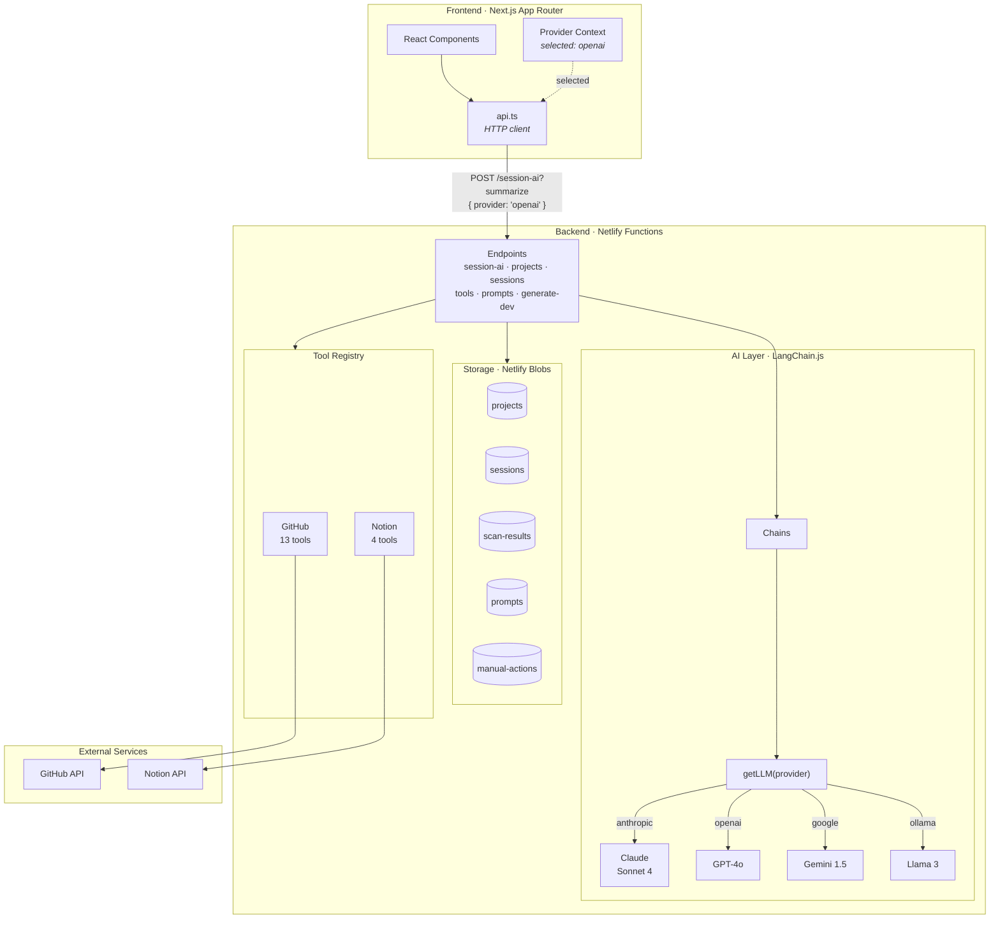

---

## Part 1: The Provider System

**Goal**: Understand how Buffr supports multiple LLM providers behind a single interface.

### Architecture

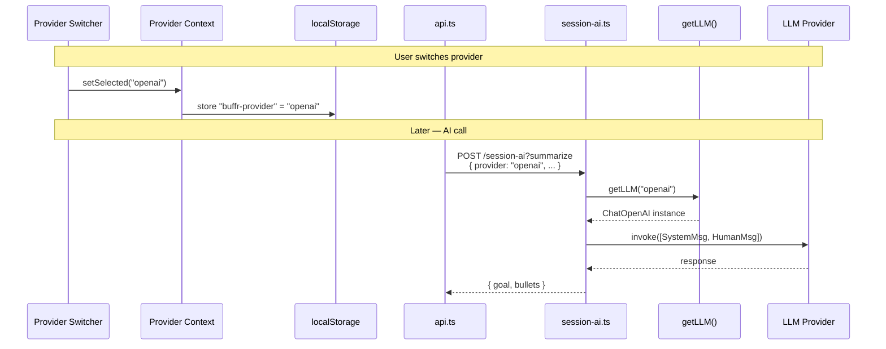

### Provider Factory Decision Tree

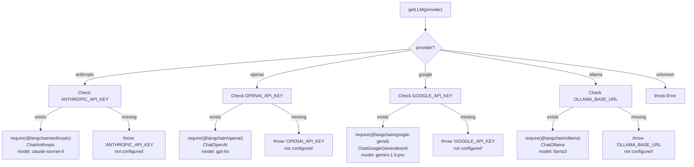

### Read these files in order:

1. **`netlify/functions/lib/ai/provider.ts`** — The core factory

   `getLLM(provider)` returns a LangChain `BaseChatModel`. Every AI feature calls this one function.

   Key observations:
   - Uses `require()` instead of `import` — why? Netlify bundles all code at build time. Dynamic require prevents loading unused SDKs (e.g., don't load `@langchain/anthropic` when using OpenAI).
   - Temperature is 0.7 everywhere — this is a balance between creativity (higher) and consistency (lower).
   - `getAvailableProviders()` checks env vars to determine what's available at runtime.

2. **`netlify/functions/providers.ts`** — The endpoint

   Simple GET endpoint that calls `getAvailableProviders()` and `getDefaultProvider()`. The frontend calls this on app load.

3. **`src/context/provider-context.tsx`** — Frontend state

   React Context that manages which provider is selected. Persists to localStorage so it survives page refreshes. Every component that calls an AI endpoint reads `selected` from this context.

4. **`src/components/provider-switcher.tsx`** — The UI control

### Exercise: Trace a provider switch

Follow what happens when a user changes from "Claude" to "GPT" in the UI:
1. `ProviderSwitcher` → `setSelected("openai")`
2. Context updates → localStorage stores `"openai"`
3. Next AI call → `body: { ..., provider: "openai" }` sent to backend
4. Backend → `getLLM("openai")` → `ChatOpenAI` instance
5. Chain runs with GPT-4o instead of Claude

---

## Part 2: Chain Architecture

**Goal**: Understand how LangChain chains transform data through AI.

### The Chain Pipeline

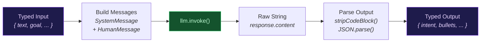

### Chain Complexity Ladder

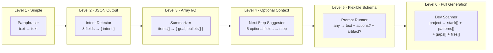

### Read in order (simplest to most complex):

#### Chain 1: Paraphraser (simplest)

**File**: `netlify/functions/lib/ai/chains/paraphraser.ts`

This is the simplest chain — no structured output, no prompt builder. Read it to understand the skeleton:

```
{ text: string } → SystemMessage + HumanMessage → LLM → { text: string }
```

Note how it handles the LLM response: `response.content` could be a string or an array (multi-modal responses). The chain normalizes this.

#### Chain 2: Intent Detector

**File**: `netlify/functions/lib/ai/chains/intent-detector.ts`

Adds **structured JSON output parsing**:

```
{ goal, whatChanged, phase } → prompt → LLM → JSON parse → { intent: string }
```

Look at:
- `buildIntentPrompt()` in `prompts/session-prompts.ts` — how context is formatted
- The system prompt asks for JSON: `Return valid JSON: { "intent": "..." }`
- `parseIntentOutput()` uses `stripCodeBlock()` to handle LLMs that wrap JSON in markdown fences

#### Chain 3: Session Summarizer

**File**: `netlify/functions/lib/ai/chains/session-summarizer.ts`

Same pattern but with **array input** and **multi-field output**:

```
{ activityItems[] } → format as bullet list → LLM → { goal, bullets[] }
```

The prompt in `session-prompts.ts` shows how to format lists:
```
- [github] Fixed login bug
- [tasks] Updated docs
- [github] Closed issue #42
```

#### Chain 4: Next Step Suggester

**File**: `netlify/functions/lib/ai/chains/next-step-suggester.ts`

Adds **optional context fields**:

```
{ goal, whatChanged, currentNextStep?, projectContext?, openItems? }
```

The prompt builder conditionally appends sections. This is how you enrich AI context without bloating every request.

#### Chain 5: Prompt Runner (most complex)

**File**: `netlify/functions/lib/ai/chains/prompt-chain.ts`

This chain handles **arbitrary user prompts** with optional tool awareness. The output schema is flexible:

```typescript
{
  text: string,              // Always present
  suggestedActions?: Array,  // Optional tool calls
  artifact?: boolean         // Flag for long-form output
}
```

Note the graceful fallback: if the LLM doesn't return JSON, the raw text becomes the `text` field.

#### Chain 6: Dev Scanner (largest)

**File**: `netlify/functions/lib/ai/chains/dev-scanner.ts`

The most complex chain. Generates an entire `.dev/` folder structure:

```
project metadata + industry standards → LLM → stack[], patterns[], gaps[], files[]
```

### Exercise: Build a new chain

Create a hypothetical "code review" chain:
1. Define input: `{ code: string, language: string }`
2. Define output: `{ issues: Array<{ line: number, severity: string, message: string }> }`
3. Write a system prompt
4. Implement using the `RunnableSequence.from([...])` pattern

---

## Part 3: Serverless API Design

**Goal**: Understand how endpoints are structured and how they route requests.

### Endpoint Routing Model

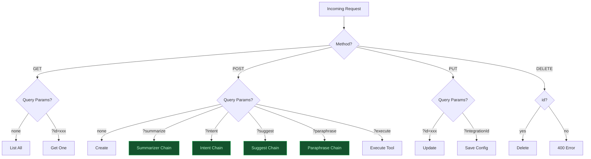

### The Handler Pattern

**File**: `netlify/functions/session-ai.ts`

This is the best file to study because it shows Buffr's routing strategy:

```typescript
export default async function handler(req: Request, _context: Context) {
  // 1. Method guard
  if (req.method !== "POST") return errorResponse("Method not allowed", 405);

  // 2. Parse body + resolve provider
  const body = await req.json();
  const llm = getLLM(body.provider || "anthropic");

  // 3. Route by query parameter
  if (url.searchParams.has("summarize")) { /* chain A */ }
  if (url.searchParams.has("intent"))    { /* chain B */ }
  if (url.searchParams.has("suggest"))   { /* chain C */ }
  if (url.searchParams.has("paraphrase")){ /* chain D */ }

  // 4. Fallback
  return errorResponse("Unknown action", 400);
}
```

**Why query params instead of separate files?** All four operations share:
- The same LLM provider resolution
- The same error handling
- The same auth context (when added)

Grouping them avoids duplicating boilerplate across four separate files.

### CRUD Pattern

**File**: `netlify/functions/projects.ts`

Standard REST CRUD with method + query param routing:

```
GET  /projects              → list all
GET  /projects?id=xxx       → get one
POST /projects              → create
PUT  /projects?id=xxx       → update
DELETE /projects?id=xxx     → delete
```

### Error Classification

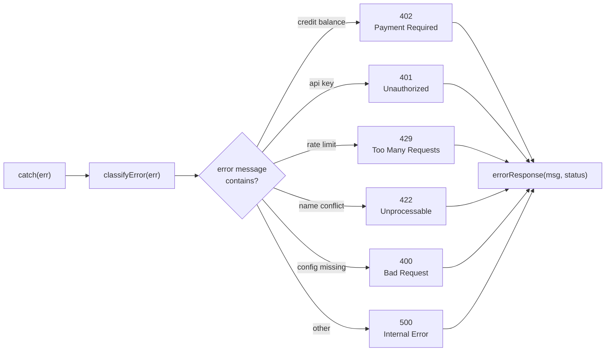

**File**: `netlify/functions/lib/responses.ts`

Three helpers used everywhere:

```typescript
json(data, 200)              // Success response
errorResponse("msg", 400)    // Error response
classifyError(err)           // Map LLM errors → HTTP status codes
```

---

## Part 4: Storage Layer

**Goal**: Understand how data persists with Netlify Blobs.

### Storage Architecture

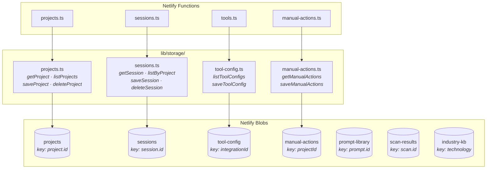

### Query Pattern (No Index)

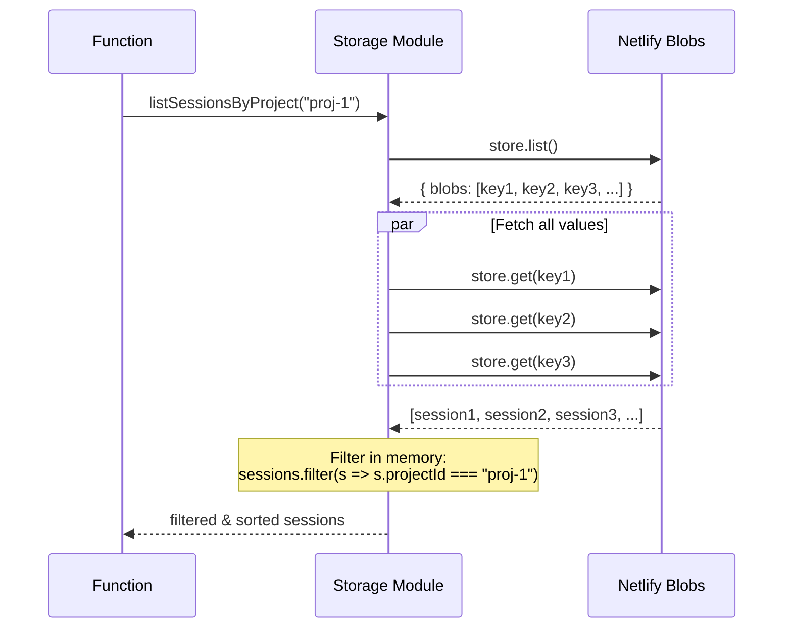

### The Blob Pattern

**File**: `netlify/functions/lib/storage/projects.ts`

Every storage module follows the same structure:

```typescript
import { getStore } from "@netlify/blobs";

const STORE_NAME = "projects";

// Get one
async function getProject(id: string): Promise<Project | null> {
  const store = getStore(STORE_NAME);
  return store.get(id, { type: "json" });
}

// List all (with in-memory filter)
async function listProjects(): Promise<Project[]> {
  const store = getStore(STORE_NAME);
  const { blobs } = await store.list();
  const all = await Promise.all(
    blobs.map(b => store.get(b.key, { type: "json" }))
  );
  return all.filter(Boolean).sort(/* by date */);
}

// Save
async function saveProject(project: Project): Promise<void> {
  const store = getStore(STORE_NAME);
  await store.setJSON(project.id, project);
}
```

### Key Limitation

Blobs have no indexes or query support. Every "query" is:
1. `store.list()` — get all keys
2. `Promise.all(...)` — fetch all values
3. `.filter(...)` — filter in memory

This works fine for < 100 items per store. At scale, you'd need a database.

---

## Part 5: Tool & Integration System

**Goal**: Understand how external services (GitHub, Notion) plug in.

### Registry Architecture

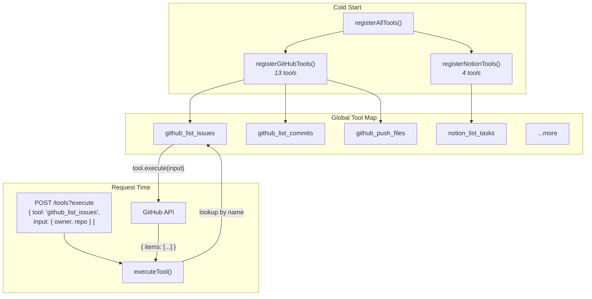

**File**: `netlify/functions/lib/tools/registry.ts`

Each tool is a self-contained unit:

```typescript
registerTool({
  name: "github_list_issues",
  integrationId: "github",
  description: "List repository issues",
  inputSchema: { owner: "string", repo: "string", state: "string" },
  execute: async (input) => {
    // Call GitHub API, return structured data
  }
});
```

### Tool Token Resolution in Prompts

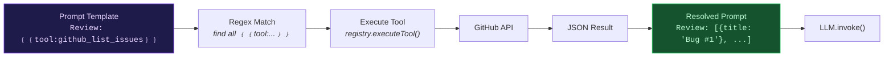

**File**: `netlify/functions/lib/resolve-tools.ts`

Prompts can embed live data using `{{tool:name}}` tokens:

```
Review these issues: {{tool:github_list_issues:{"owner":"me","repo":"app"}}}
```

Resolution happens server-side before the prompt hits the LLM:
1. Regex finds all `{{tool:...}}` tokens
2. Each tool is executed via the registry
3. Results replace the tokens as JSON strings
4. The fully-resolved prompt goes to the LLM

This keeps API keys on the server and lets prompts reference real-time data.

### Exercise: Add a new integration

To add a new integration (e.g., Linear):
1. Create `lib/linear.ts` — API client with fetch calls
2. Create `lib/tools/linear.ts` — register tools (`linear_list_issues`, etc.)
3. Add `registerLinearTools()` call in `lib/tools/register-all.ts`
4. Add config fields in `tools.ts` endpoint
5. Frontend gets the new integration automatically via `GET /tools`

---

## Part 6: Frontend → Backend Communication

**Goal**: Understand how the frontend calls all these backend services.

### Request Flow

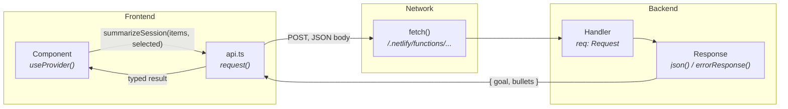

### API Client

**File**: `src/lib/api.ts`

Single `request<T>()` function wraps all fetch calls:

```typescript
async function request<T>(path: string, options?: RequestInit): Promise<T> {
  const res = await fetch(`/.netlify/functions${path}`, {
    headers: { "Content-Type": "application/json" },
    ...options,
  });
  if (!res.ok) throw new Error(data.error);
  return data as T;
}
```

Every API method is a thin wrapper:

```typescript
export const summarizeSession = (items, provider?) =>
  request("/session-ai?summarize", {
    method: "POST",
    body: JSON.stringify({ activityItems: items, provider }),
  });
```

### Pattern: Provider Threading

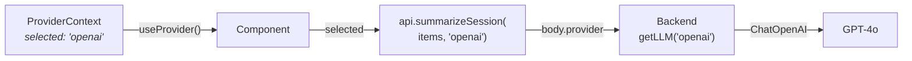

Components that call AI endpoints pull `selected` from `useProvider()` and pass it explicitly.

---

## Part 7: Putting It All Together

### Complete Request Lifecycle: "End Session"

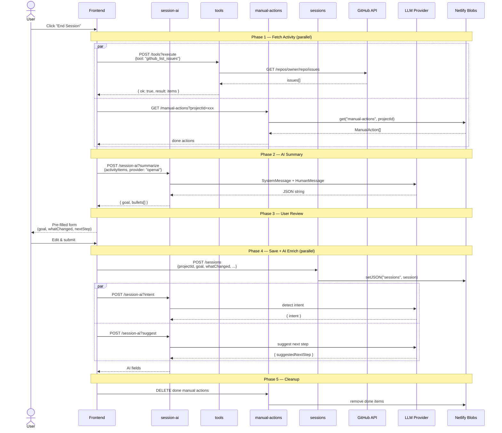

### Complete Request Lifecycle: "Generate .dev/ Folder"

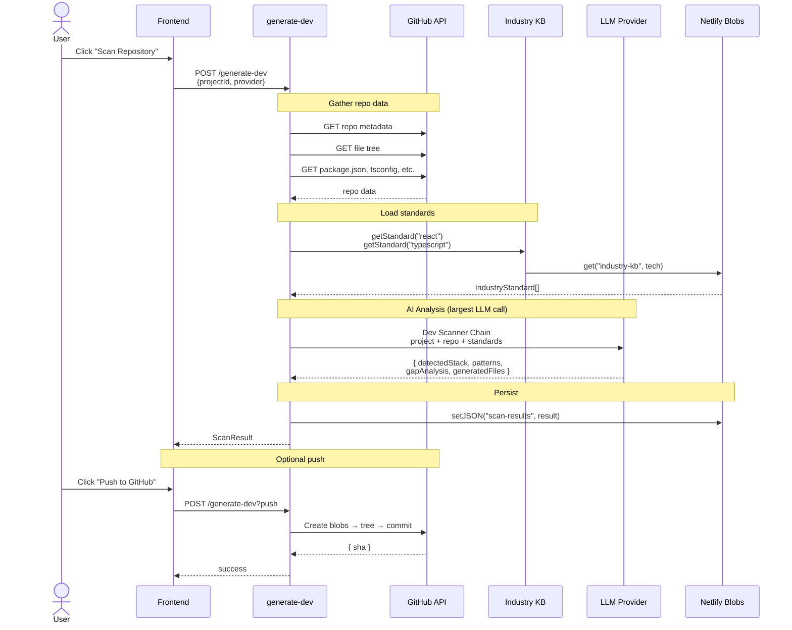

### Prompt Execution with Tool Resolution

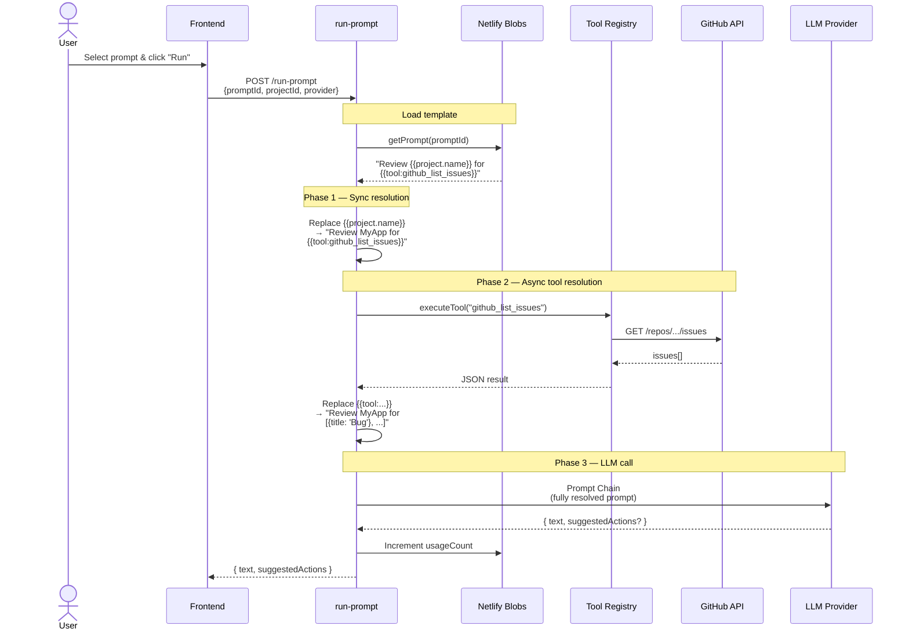

---

## Part 8: Authentication Flow

```mermaid
sequenceDiagram
    actor U as User
    participant FE as Login Page
    participant LG as /login
    participant MW as middleware.ts
    participant API as Protected Endpoint

    U->>FE: Enter username + password
    FE->>LG: POST /login<br/>{username, password}

    alt Valid credentials
        LG->>LG: createToken()<br/>JWT: HS256, 7d expiry
        LG-->>FE: 200 + Set-Cookie:<br/>buffr-token=jwt;<br/>HttpOnly; Secure; SameSite=Lax
        FE->>FE: Redirect to dashboard
    else Invalid
        LG-->>FE: 401 Unauthorized
    end

    Note over FE,API: Subsequent requests
    FE->>MW: GET /projects<br/>Cookie: buffr-token=jwt
    MW->>MW: verifyToken(jwt)
    alt Valid token
        MW->>API: Forward request
        API-->>FE: Response
    else Expired / invalid
        MW-->>FE: 302 Redirect to /login
    end
```

---

## Quick Reference: File Locations

| Concept | File |
|---------|------|
| LLM factory | `netlify/functions/lib/ai/provider.ts` |
| All AI chains | `netlify/functions/lib/ai/chains/` |
| All system prompts | `netlify/functions/lib/ai/prompts/session-prompts.ts` |
| All storage modules | `netlify/functions/lib/storage/` |
| Tool registry | `netlify/functions/lib/tools/registry.ts` |
| Tool registration | `netlify/functions/lib/tools/register-all.ts` |
| GitHub/Notion clients | `netlify/functions/lib/{github,notion}.ts` |
| API client | `src/lib/api.ts` |
| Provider context | `src/context/provider-context.tsx` |
| Response helpers | `netlify/functions/lib/responses.ts` |
| Auth (JWT) | `netlify/functions/lib/auth.ts` |
