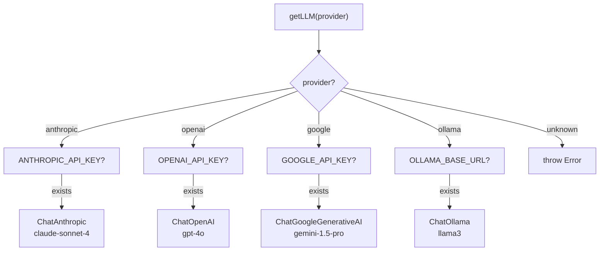
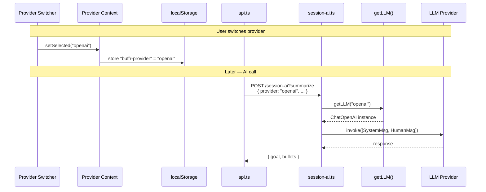
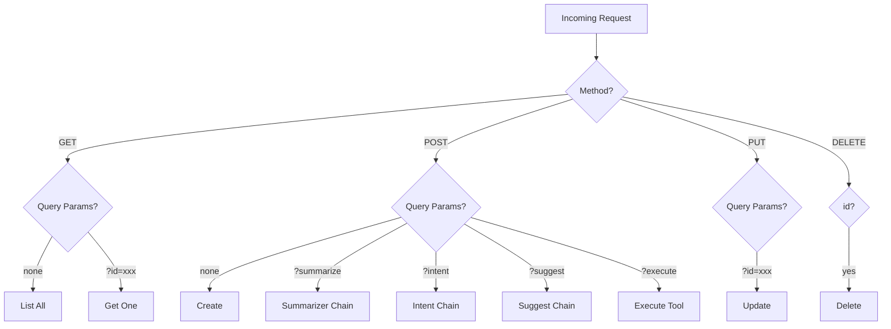
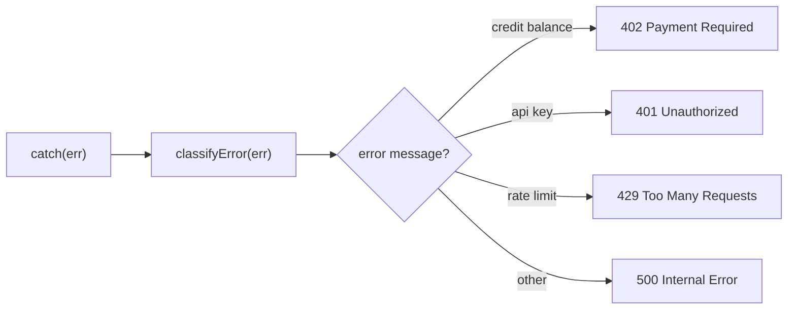
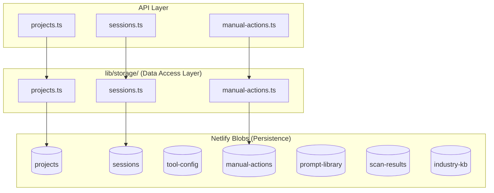
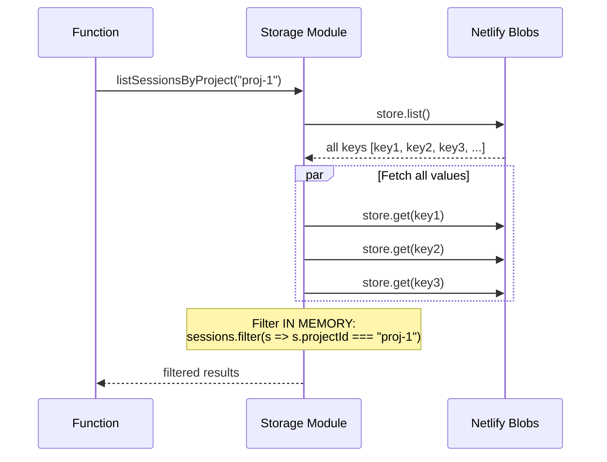
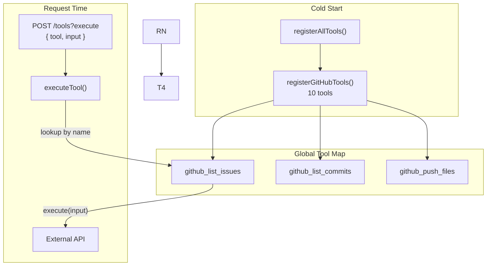
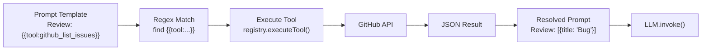
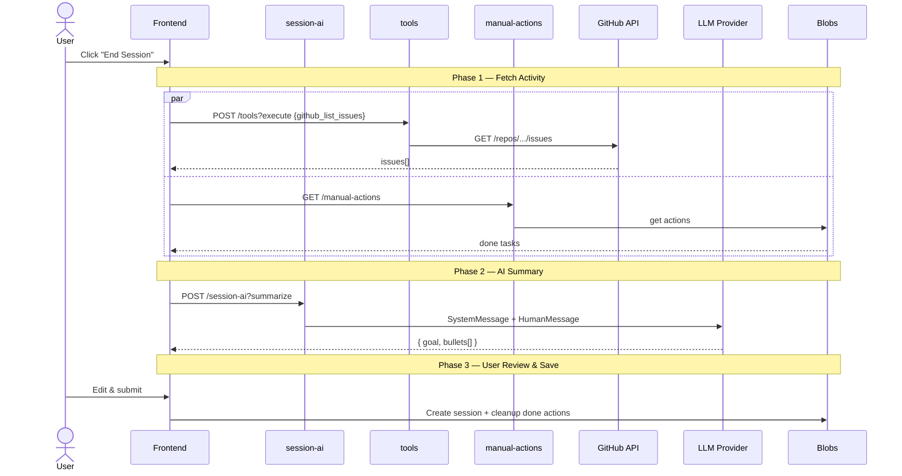
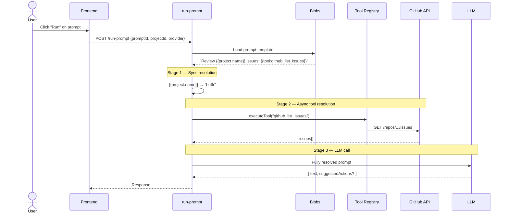

# AI & Backend Learning Guide for Frontend Developers

A practical guide for frontend developers building AI-powered products. Uses the buffr codebase as a hands-on lab — every concept maps to real code you can read and modify.

**Goal**: Go from "I build UIs" to "I ship AI products end-to-end."

---

## Table of Contents

1. [The AI Product Landscape](#part-1-the-ai-product-landscape)
2. [Backend Fundamentals](#part-2-backend-fundamentals)
3. [The Provider System](#part-3-the-provider-system)
4. [Chain Architecture](#part-4-chain-architecture)
5. [Serverless API Design](#part-5-serverless-api-design)
6. [Storage & Data Persistence](#part-6-storage--data-persistence)
7. [Tool & Integration Systems](#part-7-tool--integration-systems)
8. [Frontend ↔ Backend Communication](#part-8-frontend--backend-communication)
9. [ML & Computer Vision (MediaPipe)](#part-9-ml--computer-vision-mediapipe)
10. [AI Product Engineer Roadmap](#part-10-ai-product-engineer-roadmap)
11. [Quick Reference](#quick-reference)

---

## Part 1: The AI Product Landscape

Before diving into code, understand the three categories of AI products and where you're building:

```
┌─────────────────────────────────────────────────────────────────┐
│                     AI PRODUCT SPECTRUM                         │
├───────────────────┬────────────────────┬────────────────────────┤
│   LLM Products    │  ML Products       │  Hybrid Products       │
│   (Language)      │  (Perception)      │  (Both)                │
├───────────────────┼────────────────────┼────────────────────────┤
│ Chatbots          │ Image classifiers  │ Video captioning       │
│ Code assistants   │ Object detection   │ Multimodal search      │
│ Content gen       │ Pose estimation    │ Document understanding │
│ Summarizers       │ Speech-to-text     │ AR assistants          │
│ ★ buffr ★         │ Recommendation     │                        │
├───────────────────┼────────────────────┼────────────────────────┤
│ Key abstraction:  │ Key abstraction:   │ Combines both.         │
│ Prompt → LLM      │ Input → Model      │ Pipeline orchestration │
│ → Structured Out  │ → Prediction       │ is the hard part.      │
├───────────────────┼────────────────────┼────────────────────────┤
│ Tools:            │ Tools:             │                        │
│ LangChain         │ MediaPipe          │                        │
│ LlamaIndex        │ TensorFlow.js      │                        │
│ Vercel AI SDK     │ ONNX Runtime       │                        │
│ OpenAI SDK        │ Hugging Face       │                        │
└───────────────────┴────────────────────┴────────────────────────┘
```

**buffr is an LLM product.** It sends structured prompts to language models and parses their responses. No neural networks are trained. No images are classified. Understanding this distinction is critical — most AI product engineering today is LLM orchestration, not ML training.

### Language-Agnostic Concepts You Need

These concepts apply regardless of whether you use Python, TypeScript, Go, or Rust:

| Concept | What It Is | Where in buffr |
|---------|-----------|----------------|
| **Prompt Engineering** | Crafting instructions for LLMs to get reliable output | `lib/ai/prompts/session-prompts.ts` |
| **Chain / Pipeline** | Sequence of transformations: input → process → output | `lib/ai/chains/*.ts` |
| **Provider Abstraction** | Single interface over multiple LLM vendors | `lib/ai/provider.ts` |
| **Tool Use / Function Calling** | LLM suggests actions; your code executes them | `lib/tools/registry.ts` |
| **Structured Output** | Forcing LLMs to return parseable JSON, not free text | Every chain's parse step |
| **Context Window** | Token limit for prompt + response combined | Why prompts are kept concise |
| **Temperature** | Randomness dial: 0 = deterministic, 1 = creative | `getLLM()` sets 0.7 |
| **RAG** | Retrieval-Augmented Generation — feed real data into prompts | `{{tool:...}}` token resolution |
| **Embedding** | Convert text to vectors for similarity search | Not in buffr (future) |
| **Fine-tuning** | Train a model on your specific data | Not in buffr (uses prompting) |

---

## Part 2: Backend Fundamentals

As a frontend developer, these are the backend concepts you need to internalize:

### Mental Model: Client-Server

```
┌──────────────┐         HTTP          ┌──────────────┐
│   Browser     │  ──────────────────► │   Server      │
│   (React)     │  POST /session-ai    │   (Node.js)   │
│               │  { provider, items } │               │
│               │ ◄────────────────── │               │
│               │  { goal, bullets }   │               │
└──────────────┘                       └──────────────┘
     You own                              You also
     this side                            own this side
```

### Serverless vs Traditional Servers

```
TRADITIONAL SERVER                    SERVERLESS (buffr uses this)
┌──────────────────┐                  ┌──────────────────┐
│ Always running   │                  │ Starts on demand │
│ You manage:      │                  │ Platform manages:│
│  - OS updates    │                  │  - Scaling       │
│  - Memory        │                  │  - OS/runtime    │
│  - Port binding  │                  │  - Concurrency   │
│  - Process mgmt  │                  │                  │
│ Cost: fixed/mo   │                  │ Cost: per request│
│                  │                  │                  │
│ Express, Fastify │                  │ Netlify Functions│
│ Django, Rails    │                  │ AWS Lambda       │
│ Go net/http      │                  │ Cloudflare Wrkrs │
└──────────────────┘                  └──────────────────┘
```

**Key serverless constraint:** No persistent in-memory state. Each function invocation is isolated. That's why buffr uses Netlify Blobs (external storage) instead of in-memory variables.

### The Request-Response Cycle

Every backend interaction follows this pattern, regardless of language:

```
1. REQUEST arrives     →  HTTP method + path + headers + body
2. ROUTE to handler    →  Match method + path to a function
3. VALIDATE input      →  Check required fields, types
4. PROCESS             →  Business logic, DB queries, AI calls
5. RESPOND             →  Status code + JSON body
```

**In buffr** (`netlify/functions/session-ai.ts`):

```
1. POST /session-ai?summarize    →  Request arrives
2. if (url.has("summarize"))     →  Route by query param
3. if (!body.activityItems)      →  Validate input
4. chain.invoke(items, llm)      →  Process with AI
5. return json({ goal, bullets}) →  Respond with JSON
```

### HTTP Methods — The Universal API Language

```
GET       Read data            "Give me the projects list"
POST      Create / Execute     "Create a session" or "Run this AI chain"
PUT       Update               "Update this project's phase"
DELETE    Remove               "Delete this project"
```

buffr uses **query parameters** to sub-route within a single endpoint:

```
POST /session-ai?summarize    →  Summarize activity
POST /session-ai?intent       →  Detect intent
POST /session-ai?suggest      →  Suggest next step
POST /session-ai?paraphrase   →  Rewrite text
```

**Why?** All four share the same provider resolution and error handling. One file, less duplication.

---

## Part 3: The Provider System

**Concept**: Abstract away the specific AI vendor so your app works with any LLM.

This is the single most important pattern in AI product engineering. If you hardcode `openai.chat.completions.create()`, you're locked in. If you abstract it, you can swap providers without touching business logic.

### How It Works (Language-Agnostic)

```
┌─────────────┐     ┌──────────────┐     ┌─────────────┐
│ Your Code   │────►│ Abstraction  │────►│ Provider    │
│             │     │ Layer        │     │             │
│ "summarize  │     │ getLLM()     │     │ Claude API  │
│  these items│     │              │     │ OpenAI API  │
│  for me"    │     │ Returns a    │     │ Gemini API  │
│             │     │ standard     │     │ Ollama      │
│             │     │ interface    │     │             │
└─────────────┘     └──────────────┘     └─────────────┘
```

### Provider Factory in buffr



### Frontend → Backend Provider Threading



### Read These Files

1. **`netlify/functions/lib/ai/provider.ts`** — The factory. Note `require()` over `import` — prevents loading unused SDKs at build time.
2. **`src/context/provider-context.tsx`** — React Context that persists selection to localStorage.
3. **`src/components/provider-switcher.tsx`** — The UI control.

### Industry Equivalents

| Language | Provider Abstraction |
|----------|---------------------|
| TypeScript | LangChain.js `BaseChatModel` (buffr uses this) |
| TypeScript | Vercel AI SDK `generateText()` |
| Python | LangChain `BaseLLM` |
| Python | LiteLLM `completion()` |
| Go | go-openai + interface pattern |
| Rust | llm crate |

### Exercise

Trace a provider switch: change from Claude to GPT in the UI and follow the data through Context → localStorage → API call → backend factory → LLM invocation.

---

## Part 4: Chain Architecture

**Concept**: A chain is a sequence of transformations that turns raw input into structured output through an LLM.

This is the core pattern of LLM products. Every AI feature is a chain:

```
┌────────────┐    ┌───────────────┐    ┌──────────┐    ┌─────────────┐    ┌────────────┐
│ Typed Input│───►│ Build Messages│───►│ LLM Call │───►│ Parse Output│───►│Typed Output│
│ { items[] }│    │ System + Human│    │ invoke() │    │ JSON.parse()│    │ { goal,    │
│            │    │ messages      │    │          │    │ stripCode() │    │   bullets }│
└────────────┘    └───────────────┘    └──────────┘    └─────────────┘    └────────────┘
```

### Chain Complexity Ladder

buffr's chains increase in complexity. Read them in this order:

```
Level 1: Paraphraser         text → text              (simplest)
Level 2: Intent Detector     3 fields → { intent }    (JSON output)
Level 3: Session Summarizer  items[] → { goal, [] }   (array I/O)
Level 4: Next Step Suggester 5 fields → step          (optional context)
Level 5: Prompt Runner       any → text + actions?     (flexible schema)
Level 6: Dev Scanner         project → full analysis   (most complex)
```

### Level 1: Paraphraser (Start Here)

**File**: `netlify/functions/lib/ai/chains/paraphraser.ts`

The skeleton of every chain:

```
Input: { text: string }
  ↓
Messages: [
  SystemMessage("You rewrite task descriptions..."),
  HumanMessage(text)
]
  ↓
LLM.invoke(messages)
  ↓
Output: { text: response.content }
```

No JSON parsing needed. Read this to understand the bare minimum.

### Level 3: Session Summarizer (Key Pattern)

**File**: `netlify/functions/lib/ai/chains/session-summarizer.ts`

Introduces **structured output parsing**:

```
Input: { activityItems: [{ title, source, timestamp }] }
  ↓
Format as bullet list:
  "- [github] Fixed login bug"
  "- [tasks] Updated docs"
  ↓
LLM returns JSON string:
  '{ "goal": "...", "bullets": ["...", "..."] }'
  ↓
stripCodeBlock() removes markdown fences (```json ... ```)
  ↓
JSON.parse() → typed output
```

**Why `stripCodeBlock()`?** LLMs frequently wrap JSON in markdown code fences even when told not to. This is a universal problem — every AI product needs output sanitization.

### Level 5: Prompt Runner (Advanced)

**File**: `netlify/functions/lib/ai/chains/prompt-chain.ts`

Handles arbitrary user prompts with tool awareness:

```typescript
Output: {
  text: string,              // Always present
  suggestedActions?: Array,  // Optional tool calls the LLM recommends
  artifact?: boolean         // Flag for long-form generated content
}
```

Graceful fallback: if LLM doesn't return valid JSON, the raw text becomes the `text` field. Never crash on bad LLM output.

### Level 6: Dev Scanner (Full System)

**File**: `netlify/functions/lib/ai/chains/dev-scanner.ts`

The most complex chain — generates an entire `.dev/` folder:

```
project metadata + industry standards
  ↓
LLM analyzes against best practices
  ↓
{
  detectedStack: ["Next.js", "TypeScript", ...],
  detectedPatterns: [{ name, category, confidence }],
  gapAnalysis: [{ practice, status: "aligned"|"partial"|"gap" }],
  generatedFiles: [{ path, content, ownership }]
}
```

### Key Concept: Prompt Engineering Patterns

These patterns work across all languages and frameworks:

```
┌─────────────────────────────────────────────────────────┐
│                  PROMPT STRUCTURE                        │
├─────────────────────────────────────────────────────────┤
│                                                         │
│  SYSTEM MESSAGE (sets behavior)                         │
│  ┌─────────────────────────────────────────────────┐   │
│  │ You are a senior software architect.             │   │
│  │ You analyze codebases against industry standards.│   │
│  │ Return valid JSON matching this schema: {...}    │   │
│  └─────────────────────────────────────────────────┘   │
│                                                         │
│  HUMAN MESSAGE (provides data)                          │
│  ┌─────────────────────────────────────────────────┐   │
│  │ Project: buffr                                   │   │
│  │ Stack: Next.js, TypeScript, Tailwind             │   │
│  │ Recent activity:                                 │   │
│  │ - Fixed login bug                                │   │
│  │ - Updated docs                                   │   │
│  └─────────────────────────────────────────────────┘   │
│                                                         │
│  RULES FOR RELIABLE OUTPUT:                             │
│  1. Always specify output format in system message      │
│  2. Give examples of expected output                    │
│  3. Use constraints: "Return ONLY JSON, no markdown"    │
│  4. Handle failures gracefully (stripCodeBlock, etc.)   │
│                                                         │
└─────────────────────────────────────────────────────────┘
```

### Exercise

Create a hypothetical "code review" chain:
1. Input: `{ code: string, language: string }`
2. Output: `{ issues: [{ line, severity, message }] }`
3. Write a system prompt that ensures consistent JSON output
4. Add `stripCodeBlock()` + `JSON.parse()` with a fallback

---

## Part 5: Serverless API Design

### Endpoint Routing Model

buffr uses a flat routing strategy — one file per resource, query params for sub-operations:



### The Handler Pattern

Every serverless function follows this structure:

```typescript
// Language-agnostic pattern:
// 1. Guard on method
// 2. Parse input
// 3. Route by params
// 4. Execute logic
// 5. Return response

export default async function handler(req: Request) {
  if (req.method !== "POST") return errorResponse("Method not allowed", 405);

  const body = await req.json();
  const llm = getLLM(body.provider || "anthropic");

  if (url.searchParams.has("summarize")) { /* chain A */ }
  if (url.searchParams.has("intent"))    { /* chain B */ }

  return errorResponse("Unknown action", 400);
}
```

### Error Handling Strategy



**File**: `netlify/functions/lib/responses.ts`

The `classifyError()` function maps LLM-specific errors to standard HTTP status codes. This is essential — LLM APIs throw cryptic errors that you need to translate into something the frontend can handle.

### Industry Alternatives

| Pattern | buffr | Alternative |
|---------|-------|-------------|
| Routing | Query params in one file | Separate files per operation |
| Runtime | Netlify Functions | AWS Lambda, Cloudflare Workers, Vercel |
| Framework | Raw Request/Response | Express, Hono, tRPC |
| Validation | Manual `if (!field)` | Zod, Yup, Joi |

---

## Part 6: Storage & Data Persistence

### Key-Value vs Relational

```
KEY-VALUE (buffr uses this)          RELATIONAL (traditional)
┌──────────────────────┐             ┌──────────────────────┐
│ key → value          │             │ Tables with rows     │
│ "proj-1" → { json }  │             │ SELECT * FROM        │
│ "proj-2" → { json }  │             │   projects           │
│                      │             │   WHERE phase = 'mvp'│
│ No queries           │             │                      │
│ No indexes           │             │ Full SQL queries     │
│ No joins             │             │ Indexes for speed    │
│                      │             │ Joins across tables  │
│ Simple, fast reads   │             │ Complex, flexible    │
│ Bad for filtering    │             │ Better at scale      │
└──────────────────────┘             └──────────────────────┘
```

### Storage Architecture



### The "List + Filter" Pattern (Important Limitation)



**Why this matters**: Blobs have no query engine. Every "query" fetches ALL records and filters in JavaScript. This works for < 100 items. At scale, you'd use a database (Postgres, MongoDB, DynamoDB).

### Race Conditions in Concurrent Writes

A real bug encountered in buffr — deleting multiple items concurrently:

```
BROKEN (Promise.all):
  Delete A: read [A,B,C] → remove A → write [B,C]
  Delete B: read [A,B,C] → remove B → write [A,C]   ← concurrent, stale read!
  Result: A is back! Last write wins.

FIXED (sequential):
  Delete A: read [A,B,C] → remove A → write [B,C]
  Delete B: read [B,C]   → remove B → write [C]     ← reads fresh state
  Result: Both deleted correctly.
```

This is a **TOCTOU (Time-of-Check-Time-of-Use)** bug — a universal concurrency problem in any language. buffr fixes it by running blob mutations sequentially, not in parallel.

---

## Part 7: Tool & Integration Systems

**Concept**: A tool registry lets your AI suggest actions that your code executes. This is the foundation of "agentic" AI.

### The Registry Pattern



Each tool is a self-contained unit:

```typescript
registerTool({
  name: "github_list_issues",
  integrationId: "github",
  description: "List repository issues",
  inputSchema: { /* JSON Schema */ },
  execute: async (input) => {
    // Call GitHub API, return structured data
  }
});
```

### Tool Resolution in Prompts (RAG Pattern)

buffr implements a form of **Retrieval-Augmented Generation (RAG)** — prompts can embed live data from external services:



**Two-stage resolution** (important security pattern):

```
Stage 1 (sync):   {{project.name}} → "buffr"             Simple string replacement
Stage 2 (async):  {{tool:github_list_issues}} → [...]     Server-side API call
```

Stage 2 runs **server-side only**. This keeps API keys secure — the browser never sees GitHub tokens.

### Industry Context: MCP (Model Context Protocol)

buffr's tool registry is conceptually similar to **Anthropic's MCP** — a standard for connecting AI models to external data sources. The pattern is:

```
1. Define capabilities (tools with schemas)
2. Register at startup
3. LLM discovers available tools
4. LLM suggests tool calls
5. Your code executes them
6. Results feed back to LLM
```

This is the same pattern whether you call it "tool use", "function calling" (OpenAI), or "MCP" (Anthropic). The concept is language-agnostic.

### Exercise: Add an Integration

To add a new integration (e.g., Linear):
1. Create `lib/linear.ts` — API client
2. Create `lib/tools/linear.ts` — register tools
3. Add `registerLinearTools()` in `register-all.ts`
4. The frontend picks it up automatically via `GET /tools`

---

## Part 8: Frontend ↔ Backend Communication

### The API Client Pattern

**File**: `src/lib/api.ts`

One function wraps all HTTP calls:

```typescript
async function request<T>(path: string, options?: RequestInit): Promise<T> {
  const res = await fetch(`/.netlify/functions${path}`, {
    headers: { "Content-Type": "application/json" },
    ...options,
  });
  if (!res.ok) throw new Error(data.error);
  return data as T;
}
```

Every endpoint gets a typed wrapper:

```typescript
export const summarizeSession = (items, provider?) =>
  request<{ goal: string; bullets: string[] }>("/session-ai?summarize", {
    method: "POST",
    body: JSON.stringify({ activityItems: items, provider }),
  });
```

### Provider Threading Pattern

```
ProviderContext → useProvider() → Component → api.call(data, selected) → Backend → getLLM(provider)
```

Components pull `selected` from context and pass it explicitly to every AI API call. The backend resolves it to a concrete LLM instance.

### Complete Lifecycle: "End Session"



### Complete Lifecycle: Prompt Execution with Tool Resolution



---

## Part 9: ML & Computer Vision (MediaPipe)

buffr is an LLM product, but understanding ML broadens your capabilities as an AI product engineer. Here's how the ML world works and where **MediaPipe** fits.

### LLM vs ML: Different Problems

```
LLM (Language Models)                ML (Machine Learning)
──────────────────────               ─────────────────────
Input: Text/prompts                  Input: Images, video, audio, sensors
Output: Text/JSON                    Output: Classifications, coordinates, signals
Training: Done by vendor             Training: You might need to do this
Inference: API call                  Inference: On-device or API call
Latency: 500ms-5s                    Latency: 1ms-50ms (on-device)
Cost: Per token                      Cost: Per compute (or free on-device)

Example: "Summarize these commits"   Example: "Is this a cat or dog?"
Example: "Detect work intent"        Example: "Where are the hands in frame?"
```

### What Is MediaPipe?

**MediaPipe** is Google's framework for running pre-trained ML models **on-device** (browser, mobile, edge). No server needed. No API keys.

```
┌─────────────────────────────────────────────────────────────┐
│                    MEDIAPIPE PIPELINE                         │
│                                                              │
│  Camera/Image → Pre-process → ML Model → Post-process → UI  │
│                                                              │
│  ┌──────────┐   ┌─────────┐   ┌────────┐   ┌──────────┐    │
│  │ Webcam   │──►│ Resize  │──►│ TFLite │──►│ Draw     │    │
│  │ frame    │   │ Normalize│   │ Model  │   │ landmarks│    │
│  │ (720p)   │   │ to 256px│   │ (WASM) │   │ on canvas│    │
│  └──────────┘   └─────────┘   └────────┘   └──────────┘    │
│                                                              │
│  Runs at 30+ FPS entirely in the browser                     │
└─────────────────────────────────────────────────────────────┘
```

### MediaPipe Solutions

| Solution | What It Does | Frontend Use Case |
|----------|-------------|-------------------|
| **Hand Tracking** | 21 3D landmarks per hand | Gesture controls, sign language |
| **Pose Estimation** | 33 body landmarks | Fitness apps, motion capture |
| **Face Mesh** | 468 facial landmarks | AR filters, expression detection |
| **Object Detection** | Bounding boxes + labels | Visual search, accessibility |
| **Image Segmentation** | Pixel-level masks | Background removal, AR |
| **Text Classification** | Sentiment, topic | Content moderation |
| **Audio Classification** | Sound recognition | Voice commands, alerts |

### How MediaPipe Could Extend buffr

Hypothetical feature: **Gesture-based session control**

```
┌──────────────┐     ┌─────────────────┐     ┌──────────────┐
│ Webcam feed  │────►│ MediaPipe Hands  │────►│ Gesture      │
│ (browser)    │     │ (WASM, on-device)│     │ Classifier   │
│              │     │                  │     │              │
│              │     │ Returns 21       │     │ 👍 = Done    │
│              │     │ landmarks per    │     │ ✋ = Skip    │
│              │     │ hand at 30fps    │     │ 👊 = End     │
└──────────────┘     └─────────────────┘     └──────────────┘
                                                    │
                                                    ▼
                                            ┌──────────────┐
                                            │ buffr API    │
                                            │ handleDone() │
                                            │ handleSkip() │
                                            │ endSession() │
                                            └──────────────┘
```

### The ML Pipeline (Language-Agnostic)

Whether you use MediaPipe, TensorFlow, PyTorch, or ONNX:

```
┌──────────────────────────────────────────────────────────────┐
│               ML PIPELINE (universal)                         │
│                                                               │
│  1. DATA COLLECTION                                           │
│     Gather labeled examples: images, text, audio              │
│                                                               │
│  2. PREPROCESSING                                             │
│     Normalize, resize, augment, split train/test              │
│                                                               │
│  3. MODEL SELECTION                                           │
│     Pre-trained (MediaPipe, BERT) vs custom training          │
│                                                               │
│  4. TRAINING (if custom)                                      │
│     Feed data through model, adjust weights via backprop      │
│     Measure loss, iterate epochs                              │
│                                                               │
│  5. EVALUATION                                                │
│     Accuracy, precision, recall, F1 on test set               │
│                                                               │
│  6. DEPLOYMENT                                                │
│     Server (API) vs on-device (WASM/ONNX) vs edge (mobile)   │
│                                                               │
│  7. MONITORING                                                │
│     Track accuracy drift, latency, user feedback              │
└──────────────────────────────────────────────────────────────┘
```

**As an AI product engineer, you don't need to train models.** You need to:
- Choose the right pre-trained model
- Integrate it into your product pipeline
- Handle edge cases and failures gracefully
- Understand when to use on-device ML vs server-side LLMs

### Key ML Concepts for Product Engineers

| Concept | What It Means | Analogy |
|---------|--------------|---------|
| **Inference** | Running a trained model on new data | Calling `getLLM().invoke()` |
| **Latency** | Time from input to output | On-device: ~10ms. API: ~1000ms |
| **Model size** | File size of the neural network | MediaPipe hand: ~5MB. GPT-4: ~1TB |
| **Quantization** | Shrinking model size (some accuracy loss) | JPEG compression for models |
| **Edge inference** | Running ML on user's device | MediaPipe WASM in browser |
| **Confidence score** | How sure the model is (0-1) | `detectedPatterns[].confidence` in buffr |
| **Batch vs stream** | Process all at once vs frame-by-frame | buffr: batch. MediaPipe: stream |

---

## Part 10: AI Product Engineer Roadmap

### Where You Are Now (Frontend Developer)

```
✅ React, TypeScript, CSS
✅ Component architecture
✅ State management
✅ API consumption (fetch, REST)
✅ You built buffr's frontend
```

### Phase 1: LLM Integration (You're Here)

```
✅ Provider abstraction pattern        (Part 3 — getLLM)
✅ Chain architecture                  (Part 4 — chains/)
✅ Prompt engineering                  (Part 4 — session-prompts.ts)
✅ Structured output parsing           (Part 4 — stripCodeBlock + JSON.parse)
✅ Tool/function calling               (Part 7 — registry)
◻ Streaming responses                 (SSE / WebSocket for token-by-token)
◻ Embeddings + vector search          (RAG with semantic similarity)
◻ Multi-turn conversations            (Chat history management)
```

**Practice in buffr**: Add streaming to the prompt runner. Instead of waiting for the full response, stream tokens to the UI as they arrive using Server-Sent Events.

### Phase 2: Backend Proficiency

```
✅ Serverless functions                (Part 5 — Netlify Functions)
✅ REST API design                     (Part 5 — handler pattern)
✅ Key-value storage                   (Part 6 — Netlify Blobs)
✅ Auth (JWT)                          (login.ts, middleware.ts)
◻ Relational databases               (Postgres, SQL basics)
◻ Queue/job systems                   (Background processing)
◻ Caching strategies                  (Redis, CDN, stale-while-revalidate)
◻ Rate limiting                       (Protect LLM endpoints from abuse)
◻ Observability                       (Logging, tracing, error tracking)
```

**Practice in buffr**: Add rate limiting to `session-ai.ts`. Track requests per user per minute using a blob store counter.

### Phase 3: ML Awareness

```
◻ Pre-trained model integration       (MediaPipe, Hugging Face)
◻ On-device inference                 (WASM, TFLite, ONNX)
◻ Image/video processing pipeline     (Canvas API + ML model)
◻ Evaluation metrics                  (When is your AI "good enough"?)
◻ Data pipeline basics                (Collection → cleaning → training)
```

**Practice**: Add a MediaPipe hand-tracking feature to buffr. Use the `@mediapipe/tasks-vision` npm package to detect a thumbs-up gesture and trigger `handleActionDone()`.

### Phase 4: AI Product Thinking

```
◻ Evaluation-driven development       (Measure AI quality with test suites)
◻ Prompt versioning                   (Track which prompts perform best)
◻ Cost optimization                   (Token usage tracking, model routing)
◻ Fallback strategies                 (Model A fails → try Model B)
◻ Human-in-the-loop                   (User corrects AI, improves over time)
◻ A/B testing AI features             (Which prompt/model produces better UX?)
```

### Industry Roles Spectrum

```
Frontend Dev → Full-Stack Dev → AI Product Engineer → ML Engineer → Research
     ▲              ▲                  ▲                  ▲            ▲
  You were       You are            You're             Needs PhD    Needs PhD
  here           building           heading            level math   level math
                 towards            here
                 this
```

**AI Product Engineer** is the sweet spot: you don't need to train models or publish papers. You need to orchestrate AI capabilities into products that users love. That means:

1. **Choosing the right model** for each task (cost vs quality vs latency)
2. **Designing reliable pipelines** (chains, fallbacks, retries)
3. **Building great UX around AI** (loading states, error handling, confidence display)
4. **Measuring quality** (does the AI actually help users?)

### Recommended Reading

**LLM Fundamentals**
- [Prompt Engineering Guide](https://www.promptingguide.ai/) — Patterns that work across all models
- [LangChain.js Concepts](https://js.langchain.com/docs/concepts/) — Chains, agents, tools
- [Anthropic Cookbook](https://github.com/anthropics/anthropic-cookbook) — Practical prompt patterns

**Backend & Architecture**
- [The Twelve-Factor App](https://12factor.net/) — Language-agnostic app design
- [Designing Data-Intensive Applications](https://dataintensive.net/) — Storage, caching, consistency

**ML & MediaPipe**
- [MediaPipe Solutions Guide](https://ai.google.dev/edge/mediapipe/solutions/guide) — On-device ML tasks
- [TensorFlow.js](https://www.tensorflow.org/js) — ML in the browser
- [Hugging Face](https://huggingface.co/) — Pre-trained models for everything

**AI Product Engineering**
- [Building LLM Apps](https://www.oreilly.com/library/view/building-llm-apps/9781835462317/) — End-to-end product development
- [AI Engineering](https://www.oreilly.com/library/view/ai-engineering/9781098166298/) — From prototype to production

---

## Quick Reference

### File Locations

| Concept | File |
|---------|------|
| LLM factory | `netlify/functions/lib/ai/provider.ts` |
| All AI chains | `netlify/functions/lib/ai/chains/` |
| System prompts | `netlify/functions/lib/ai/prompts/session-prompts.ts` |
| Storage modules | `netlify/functions/lib/storage/` |
| Tool registry | `netlify/functions/lib/tools/registry.ts` |
| Tool registration | `netlify/functions/lib/tools/register-all.ts` |
| GitHub client | `netlify/functions/lib/github.ts` |
| API client | `src/lib/api.ts` |
| Provider context | `src/context/provider-context.tsx` |
| Response helpers | `netlify/functions/lib/responses.ts` |
| Auth (JWT) | `netlify/functions/lib/auth.ts` |

### Glossary

| Term | Definition |
|------|-----------|
| **Chain** | Input → transform → LLM → parse → output pipeline |
| **Provider** | An LLM vendor (Anthropic, OpenAI, Google, Ollama) |
| **Tool** | A registered capability that AI can invoke |
| **RAG** | Feeding real data into prompts before LLM processing |
| **Structured Output** | Forcing LLM to return parseable JSON |
| **Temperature** | Randomness control (0=deterministic, 1=creative) |
| **Context Window** | Max tokens for prompt + response |
| **Inference** | Running a trained model on new input |
| **Edge Inference** | Running ML on user's device (browser/mobile) |
| **TOCTOU** | Time-of-check-time-of-use race condition |
| **MCP** | Model Context Protocol — standard for AI tool integration |
| **Embedding** | Converting text to a numerical vector for similarity search |
