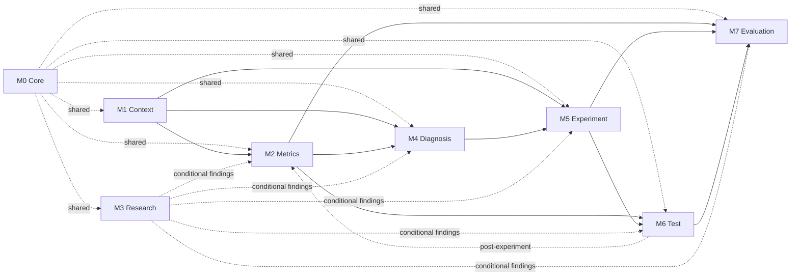
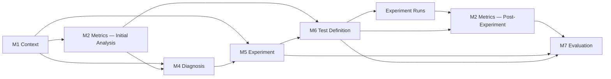
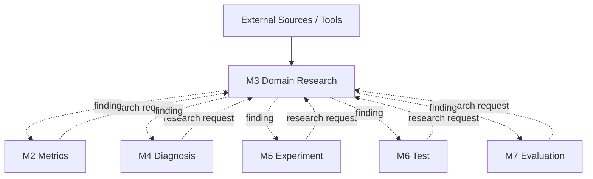

# Etsy Agent Dependency Mapping — Matrix & Graphs V1

This document derives the **prompt-module dependency map** from the latest module contracts.

It answers:

> **What does each module require from other modules, and where are those dependencies required, conditional, shared, or lifecycle-specific?**

This is a dependency artifact, not yet the final workflow/orchestration specification.

---

# 1. Module Versions Used

| Module | Current prompt |
|---|---|
| M0 — Core Agent | `etsy-core-agent-prompt-v3.md` |
| M1 — Product Context / Observation | `product-context-observation-module-v2.md` |
| M2 — Metrics & Qualification | `metrics-qualification-module-v3.md` |
| M3 — Domain Research | `domain-research-module-v2.md` |
| M4 — Classification & Diagnosis | `classification-diagnosis-module-v3.md` |
| M5 — Hypothesis & Experiment Design | `hypothesis-experiment-design-module-v3.md` |
| M6 — Test Definition | `test-definition-module-v3.md` |
| M7 — Evaluation & Learning | `evaluation-learning-module-v3.md` |

---

# 2. Dependency Types

Keep the model small.

| Symbol | Meaning |
|---|---|
| **S** | Shared policy dependency — Core behavior applies to the module |
| **R** | Required data dependency — the consumer requires the producer's output |
| **C** | Conditional dependency — required only if a specific research need occurs |
| **P** | Phase-specific dependency — required only in a later lifecycle phase |
| **—** | No direct module dependency |

Important:

> A dependency does not automatically mean the producer runs immediately before the consumer.

Dependency describes **required information**, not execution order.

---

# 3. Producer → Consumer Dependency Matrix

Rows are **producers**.  
Columns are **consumers**.

| Producer ↓ / Consumer → | M0 | M1 | M2 | M3 | M4 | M5 | M6 | M7 |
|---|---:|---:|---:|---:|---:|---:|---:|---:|
| **M0 — Core** | — | **S** | **S** | **S** | **S** | **S** | **S** | **S** |
| **M1 — Context** | — | — | **R** | — | **R** | **R** | — | — |
| **M2 — Metrics** | — | — | — | — | **R** | — | **R** | **R** |
| **M3 — Research** | — | — | **C** | — | **C** | **C** | **C** | **C** |
| **M4 — Diagnosis** | — | — | — | — | — | **R** | — | — |
| **M5 — Experiment** | — | — | — | — | — | — | **R** | **R** |
| **M6 — Test** | — | — | **P** | — | — | — | — | **R** |
| **M7 — Evaluation** | — | — | — | — | — | — | — | — |

---

# 4. What the Matrix Means

## M0 — Core Agent

M0 is not a normal data-processing step.

It provides shared identity, reasoning policy, uncertainty handling, and guardrails to every operational module.

```text
M0
 ├── M1
 ├── M2
 ├── M3
 ├── M4
 ├── M5
 ├── M6
 └── M7
```

This is a **shared policy dependency**, not ordinary pipeline data.

---

## M1 — Product Context / Observation

M1 directly supplies information to:

- **M2** — raw and reported evidence,
- **M4** — product context, listing presentation, evidence provenance,
- **M5** — current product and listing presentation needed to design a specific revision.

The M1 → M4 and M1 → M5 dependencies are intentional.

M2 does not reproduce all of the listing and product context those modules need.

---

## M2 — Metrics & Qualification

M2 directly supplies:

- **M4** — calculated metrics, baseline comparison, comparison validity, qualification,
- **M6** — validated baseline, comparison validity, applicable qualification rules,
- **M7** — post-experiment calculated and qualified evidence.

M2 therefore acts as the system's **metric-quality gatekeeper**.

---

## M3 — Domain Research

M3 is a conditional callable service.

It can return findings to:

- M2,
- M4,
- M5,
- M6,
- M7.

M3 is not a mandatory stage between M2 and M4.

A module calls M3 only when a specific knowledge gap blocks or materially weakens its own responsibility.

---

## M4 — Classification & Diagnosis

M4 supplies the accepted diagnosis to **M5**.

M5 requires:

- the diagnostic decision,
- primary bottleneck,
- evidence,
- competing explanation,
- confidence.

---

## M5 — Hypothesis & Experiment Design

M5 directly supplies:

- **M6** — hypothesis and experiment design needed to define the test,
- **M7** — hypothesis and intervention context needed to interpret the completed experiment.

The direct M5 → M7 dependency is currently intentional rather than forcing M6 to duplicate the full experiment-design contract.

---

## M6 — Test Definition

M6 directly supplies:

- **M7** — frozen measurement plan and context-to-monitor,
- **M2**, but only in the **post-experiment phase**, when M2 is invoked again to calculate and qualify the completed experiment results.

That M6 → M2 relationship is phase-specific.

It does **not** mean M2 and M6 form an invalid circular dependency during one execution step.

---

## M7 — Evaluation & Learning

M7 is the terminal analytical module for the current optimization cycle.

Its outputs may influence the next cycle through orchestration, but the next-cycle routing is a **workflow concern**, not a direct dependency to add to this matrix yet.

---

# 5. Static Dependency Graph

The following graph shows direct module dependencies.

Solid arrows are required data dependencies.  
Dotted arrows represent shared or conditional relationships.



---

# 6. Lifecycle-Expanded Dependency Graph

The static graph contains an apparent M2 ↔ M6 relationship.

The cleaner way to understand it is to show **two invocations of the same M2 module** at different lifecycle phases.



This graph is still a **dependency/lifecycle view**, not the final orchestration flow.

Key point:

> **M2 is reused. It is not duplicated into a second module.**

The labels `M2A` and `M2B` only represent two invocations of M2.

---

# 7. Conditional Research Service Graph

Research is easier to understand separately from the primary module chain.



This means M3 behaves more like a **shared callable capability** than a fixed pipeline step.

---

# 8. ASCII Fallback

If the local Markdown viewer does not render Mermaid:

```text
                         M0 CORE
                    shared policy layer
                           │
          ┌────────────────┼────────────────┐
          │                │                │
          ▼                ▼                ▼
         M1               M3            all modules
      CONTEXT          RESEARCH          inherit M0
          │           conditional
          │
          ├───────────────┐
          ▼               ▼
         M2 ─────────────► M4
       METRICS          DIAGNOSIS
          │               │
          │               ▼
          │              M5
          │           EXPERIMENT
          │             /   \
          ▼            ▼     ▼
         M6 ───────────────► M7
        TEST              EVALUATION
          │                  ▲
          │                  │
          └─ post-test ─► M2 │
                          │   │
                          └───┘
                    qualified results
```

The apparent M6 → M2 → M7 loop occurs across experiment phases, not within one simultaneous execution step.

---

# 9. Research Call Matrix

This matrix answers a different question:

> **Which modules are allowed to invoke M3 when they encounter a blocking knowledge gap?**

| Calling Module | Can Call M3? | Typical Reason |
|---|---:|---|
| M1 — Context | No current trigger | M1 records available evidence; it does not execute analytical research |
| M2 — Metrics | **Yes** | unresolved threshold or qualification rule |
| M4 — Diagnosis | **Yes** | domain uncertainty blocks diagnosis |
| M5 — Experiment | **Yes** | knowledge gap blocks a defensible intervention |
| M6 — Test | **Yes** | measurement rule is undefined |
| M7 — Evaluation | **Yes** | domain or methodological uncertainty blocks evaluation/next action |

M3 returns its finding to the module that called it.

---

# 10. Dependency Audit Findings

## Finding 1 — No accidental linear dependency on M3

The architecture should **not** be modeled as:

```text
M1 → M2 → M3 → M4 → M5 → M6 → M7
```

That would incorrectly make research mandatory.

Instead, M3 is conditional.

---

## Finding 2 — M2 is invoked in two lifecycle phases

M2 participates in:

### Initial analysis

```text
M1 → M2 → M4
```

### Post-experiment analysis

```text
M6 + raw experiment results → M2 → M7
```

This is a reusable-module pattern, not an architectural contradiction.

---

## Finding 3 — Some modules legitimately have more than one upstream dependency

Examples:

### M4

Needs both:

- M1 product/evidence context,
- M2 qualified metric evidence.

### M6

Needs both:

- M5 experiment design,
- M2 baseline and qualification rules.

### M7

Needs:

- M5 experiment/hypothesis context,
- M6 frozen test plan,
- M2 qualified post-experiment results.

This is intentional and should not be simplified merely to make the diagram linear.

---

## Finding 4 — Keep direct M1 → M5 for now

M5 needs actual product/listing presentation to propose a concrete revision.

M4's diagnosis output does not currently carry the complete listing presentation.

Keeping the direct M1 → M5 dependency avoids bloating M4 just to relay information M1 already owns.

---

## Finding 5 — Keep direct M5 → M7 for now

M7 needs experiment/hypothesis context.

M6 contains only the measurement plan plus a partial experiment reference.

Keeping M5 → M7 avoids forcing M6 to become a duplicate container for the full experiment-design output.

---

# 11. Current Dependency Map by Consumer

## M1 — Product Context / Observation

**Required**
- M0 shared policy

**Conditional**
- none

---

## M2 — Metrics & Qualification

### Initial analysis

**Required**
- M0
- M1

### Post-experiment invocation

**Required**
- M0
- M6
- raw experiment-result data

**Conditional**
- M3 research finding

---

## M3 — Domain Research

**Required**
- M0
- focused research request from the calling module
- external sources/tools when supplied evidence cannot resolve the question

**Callable by**
- M2
- M4
- M5
- M6
- M7

---

## M4 — Classification & Diagnosis

**Required**
- M0
- M1
- M2

**Conditional**
- M3

---

## M5 — Hypothesis & Experiment Design

**Required**
- M0
- M4
- M1

**Conditional**
- M3

---

## M6 — Test Definition

**Required**
- M0
- M5
- M2

**Conditional**
- M3

---

## M7 — Evaluation & Learning

**Required**
- M0
- M5
- M6
- post-experiment M2 output

**Conditional**
- M3

---

# 12. What We Have Not Defined Yet

This dependency map deliberately does **not** define:

- exact execution order,
- branching logic,
- retries,
- stop conditions,
- waiting for experiment results,
- next-cycle routing,
- API / TypeScript interfaces,
- JSON schemas,
- database structures.

Those belong to later layers.

The next architecture step is the **Workflow Execution Diagram**, using this dependency map as a constraint.

---

# 13. Dependency Mapping Status

```text
[x] Prompt responsibilities separated
[x] Module prompts revised
[x] Lean module contracts added
[x] Producer → consumer dependency matrix
[x] Required dependencies identified
[x] Conditional M3 dependencies identified
[x] Phase-specific M6 → M2 dependency identified
[x] Static dependency graph
[x] Lifecycle-expanded graph
[x] Research-service graph

NEXT:
[ ] Workflow execution / orchestration map
```

---

# Key Principle

> **Contracts tell us what a module needs.  
> Dependency mapping tells us where that information comes from.  
> Workflow orchestration will tell us when each module runs.**
