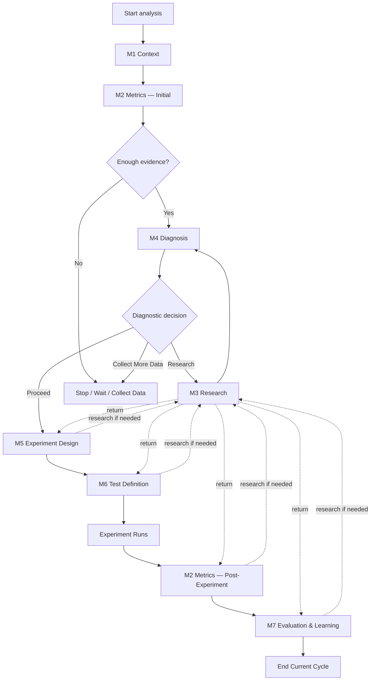

# Etsy Agent Workflow Execution Spec — V1

This document defines the **runtime execution flow** for the Etsy Product Optimization Analyst.

It is intentionally lightweight.

It answers:

> **When does each module run, where does the system branch, where does it stop, and when does it loop back?**

This document does **not** define API contracts, schemas, implementation code, retries, queues, or persistence.

---

# 1. Runtime Principles

## M0 Is Shared Policy, Not a Workflow Step

**M0 — Core Agent** applies to every operational module.

It should not appear as a normal sequential processing node.

---

## M3 Is Conditional

**M3 — Domain Research** runs only when another module encounters a blocking or material knowledge gap.

After research completes, control returns to the module that requested it.

---

## M2 Is Reused

**M2 — Metrics & Qualification** runs in two different lifecycle phases:

1. initial product-performance analysis,
2. post-experiment result qualification.

This is the same module invoked twice, not two separate modules.

---

# 2. Flow A — Initial Product Analysis

## Trigger

A product/listing is submitted for performance analysis with available Etsy evidence.

## Execution Path

```text
START
  ↓
M1 — Product Context / Observation
  ↓
M2 — Metrics & Qualification
  ↓
Evidence sufficient for diagnosis?
  ├── NO → STOP / REQUEST MORE DATA
  └── YES
        ↓
M4 — Classification & Diagnosis
```

## Decision Gates

### Gate A1 — Can M2 Qualify the Evidence?

If required product data is missing:

```text
M2
 ↓
REQUEST MORE DATA
 ↓
STOP
```

If M2 requires external or specialized knowledge:

```text
M2
 ↓
M3 — Domain Research
 ↓
return to M2
```

### Gate A2 — M4 Diagnostic Decision

M4 selects exactly one:

```text
PROCEED TO HYPOTHESIS
RESEARCH DOMAIN KNOWLEDGE
COLLECT MORE DATA
```

Routing:

```text
PROCEED TO HYPOTHESIS
  ↓
Flow C — Experiment Setup

RESEARCH DOMAIN KNOWLEDGE
  ↓
Flow B — Research Detour

COLLECT MORE DATA
  ↓
STOP / WAIT
```

## Terminal Outputs

This flow ends with one of:

- a defensible diagnosis ready for experiment design,
- a specific research requirement,
- a request for additional product evidence.

---

# 3. Flow B — Research Detour

## Trigger

M2, M4, M5, M6, or M7 detects a blocking or material domain-knowledge gap.

## Execution Path

```text
Calling Module
  ↓
Formulate specific research question
  ↓
M3 — Domain Research
  ↓
Research status?
  ├── RESOLVED
  ├── PARTIALLY RESOLVED
  └── UNRESOLVED
```

## Decision Gates

### RESOLVED

Return the finding to the calling module.

```text
M3
 ↓
Calling Module
 ↓
continue original responsibility
```

### PARTIALLY RESOLVED

Return the finding and remaining uncertainty.

The calling module decides whether:

- the remaining uncertainty is acceptable,
- more data is needed,
- another research question is needed.

### UNRESOLVED

Return to the calling module with the unresolved status.

The calling module should normally stop, wait, or request additional evidence rather than inventing an answer.

## Terminal Output

A structured research finding is returned to the module that requested it.

M3 does not independently advance the main workflow.

---

# 4. Flow C — Hypothesis and Experiment Setup

## Trigger

M4 returns:

**PROCEED TO HYPOTHESIS**

## Execution Path

```text
M4 — Accepted Diagnosis
  ↓
M5 — Hypothesis & Experiment Design
  ↓
Blocking knowledge gap?
  ├── YES → Flow B — Research Detour → return to M5
  └── NO
        ↓
M6 — Test Definition
  ↓
Measurement rule unresolved?
  ├── YES → Flow B — Research Detour → return to M6
  └── NO
        ↓
EXPERIMENT READY
```

## Decision Gates

### Gate C1 — Can M5 Design a Defensible Experiment?

If no:

- formulate a research question,
- call M3,
- return to M5.

### Gate C2 — Can M6 Define a Defensible Measurement Plan?

If no:

- formulate the missing measurement/research requirement,
- call M3,
- return to M6.

### Gate C3 — Is the Experiment Ready to Run?

The experiment is ready only when M6 has:

- primary metric,
- secondary metrics where useful,
- validated baseline reference,
- qualification requirements,
- expected signal,
- context to monitor,
- no unresolved blocking measurement rule.

## Terminal Output

A frozen experiment plan ready for execution.

The system then waits for the real-world experiment to run and produce new data.

---

# 5. Flow D — Post-Experiment Evaluation

## Trigger

The experiment has completed and new result data is available.

## Execution Path

```text
NEW EXPERIMENT DATA
  ↓
M2 — Metrics & Qualification
(post-experiment invocation)
  ↓
Qualified experiment evidence
  ↓
M7 — Evaluation & Learning
  ↓
Outcome + Learning + Next Action
```

M2 uses:

- raw experiment-result data,
- M6 frozen measurement plan,
- frozen baseline,
- validated qualification rules.

M7 uses:

- M5 hypothesis and intervention context,
- M6 frozen measurement plan,
- post-experiment M2 results,
- actual observed contextual conditions.

## Decision Gates

### Gate D1 — Can M2 Qualify the Experiment Result?

If no:

```text
M2
 ↓
INCONCLUSIVE or RESEARCH / MORE DATA NEEDED
```

If research is required:

```text
M2
 ↓
M3
 ↓
return to M2
```

### Gate D2 — M7 Outcome

M7 selects exactly one:

```text
WIN
LOSS
INCONCLUSIVE
```

### Gate D3 — M7 Next Action

M7 selects exactly one:

```text
KEEP
REVERT
ITERATE
NEW TEST
RESEARCH
WAIT
```

## Terminal Output

The current optimization cycle ends with:

- experiment outcome,
- hypothesis evaluation,
- captured learning,
- one next action.

M7 does not start the next cycle itself.

---

# 6. Next-Action Routing

This routing belongs to orchestration, not M7's prompt.

```text
KEEP
  ↓
retain current change
  ↓
END CURRENT CYCLE

REVERT
  ↓
restore previous version
  ↓
END CURRENT CYCLE

ITERATE
  ↓
start a new cycle using current learning
  ↓
usually return to M4 or M5 depending on orchestration design

NEW TEST
  ↓
start a new hypothesis / experiment cycle
  ↓
return to appropriate upstream analysis stage

RESEARCH
  ↓
M3 — Domain Research
  ↓
resume the next-cycle decision after findings return

WAIT
  ↓
collect additional evidence
  ↓
resume when required data exists
```

The exact next-cycle entry point can be finalized during implementation.

---

# 7. Compact End-to-End View



---

# 8. What This Spec Intentionally Leaves for the Coding Agent

Do not define here:

- TypeScript interfaces,
- API endpoints,
- JSON schemas,
- persistence,
- queues,
- retry behavior,
- tool invocation code,
- database state,
- background jobs,
- event handling,
- experiment scheduling.

Those are implementation concerns.

---

# Key Principle

> **Dependency mapping tells us what information must exist.  
> Workflow execution tells us when modules run and where control moves next.**
